# ASCII Diagram Standards

**Applicable to**: Code generation output (source code comments and documentation within generated files)

## MANDATORY: Use Basic ASCII Only

**CRITICAL**: ALWAYS use basic ASCII characters for diagrams in generated code comments (maximum compatibility).

### ALLOWED: `+` `-` `|` `^` `v` `<` `>` and alphanumeric text

### FORBIDDEN: Unicode box-drawing characters
- NO: `┌` `─` `│` `└` `┐` `┘` `├` `┤` `┬` `┴` `┼` `▼` `▲` `►` `◄`
- Reason: Inconsistent rendering across fonts/platforms

## Standard ASCII Diagram Patterns

### CRITICAL: Character Width Rule
**Every line in a box MUST have EXACTLY the same character count (including spaces)**

CORRECT (all lines = 67 chars):
```
+---------------------------------------------------------------+
|                      Component Name                           |
|  Description text here                                        |
+---------------------------------------------------------------+
```

WRONG (inconsistent widths):
```
+---------------------------------------------------------------+
|                      Component Name                           |
|  Description text here                                   |
+---------------------------------------------------------------+
```

### Box Pattern
```
+-----------------------------------------------------+
|                                                     |
|              Calculator Application                 |
|                                                     |
|  Provides basic arithmetic operations for users     |
|  through a web-based interface                      |
|                                                     |
+-----------------------------------------------------+
```

### Nested Boxes
```
+-------------------------------------------------------+
|              Web Server (PHP Runtime)                 |
|  +-------------------------------------------------+  |
|  |  index.php (Monolithic Application)             |  |
|  |  +-------------------------------------------+  |  |
|  |  |  HTML Template (View Layer)               |  |  |
|  |  |  - Form rendering                         |  |  |
|  |  |  - Result display                         |  |  |
|  |  +-------------------------------------------+  |  |
|  +-------------------------------------------------+  |
+-------------------------------------------------------+
```

### Arrows and Connections
```
+----------+
|  Source  |
+----------+
     |
     | HTTP POST
     v
+----------+
|  Target  |
+----------+
```

### Horizontal Flow
```
+-------+     +-------+     +-------+
| Step1 | --> | Step2 | --> | Step3 |
+-------+     +-------+     +-------+
```

### Vertical Flow with Labels
```
User Action Flow:
    |
    v
+----------+
|  Input   |
+----------+
    |
    | validates
    v
+----------+
| Process  |
+----------+
    |
    | returns
    v
+----------+
|  Output  |
+----------+
```

## Validation

Before creating diagrams in generated code:
- [ ] Basic ASCII only: `+` `-` `|` `^` `v` `<` `>`
- [ ] No Unicode box-drawing
- [ ] Spaces (not tabs) for alignment
- [ ] Corners use `+`
- [ ] **ALL box lines same character width** (count characters including spaces)
- [ ] Test: Verify corners align vertically in monospace font

## Alternative

For complex diagrams in generated code, use Mermaid syntax in markdown documentation files (see `content-validation.md`).


---

# Content Validation Rules

## MANDATORY: Content Validation Before Code Generation

**CRITICAL**: All generated code MUST be validated before writing to the filesystem.

## Code Validation

### Pre-Generation Validation Checklist
- [ ] Validate code syntax and structure
- [ ] Check special character escaping
- [ ] Verify imports and dependencies are correct
- [ ] Test content parsing compatibility
- [ ] Ensure generated code compiles/parses correctly

### Code Quality Rules
1. **Always validate before writing files**: Never write unvalidated code to the filesystem
2. **Escape special characters**: Particularly in strings, templates, and configuration files
3. **Verify syntax**: Validate language-specific syntax before writing
4. **Test imports**: Ensure all imports reference existing modules

## ASCII Diagram Standards (for code comments only)

**When generating code that includes ASCII diagrams in comments:**

1. **VALIDATE** each diagram:
   - Count characters per line (all lines MUST be same width)
   - Use ONLY: `+` `-` `|` `^` `v` `<` `>` and spaces
   - NO Unicode box-drawing characters
   - Spaces only (NO tabs)
2. **TEST** alignment by verifying box corners align vertically

**See `common/ascii-diagram-standards.md` for patterns and validation checklist.**

## Validation Failure Handling

### When Validation Fails
1. **Log the error**: Record what failed validation
2. **Fix the issue**: Correct the validation error
3. **Retry**: Re-validate after fixing
4. **Continue workflow**: Don't block on non-critical validation failures
5. **Inform team**: Use `ask_question` if validation failure affects the design or requires input


---

# Adaptive Depth

**Purpose**: Explain how AI-DLC adapts detail level to problem complexity

## Core Principle

**When a stage executes, ALL its defined artifacts are created as graph nodes. The "depth" refers to the level of detail and rigor within those artifacts, which adapts to the problem's complexity.**

## Stage Selection vs Detail Level

### Stage Selection (Binary)
- **Workflow Planning** decides: EXECUTE or SKIP for each stage
- **If EXECUTE**: Stage runs and creates ALL its defined graph nodes
- **If SKIP**: Stage doesn't run at all

### Detail Level (Adaptive)
- **Simple problems**: Concise node properties with essential detail
- **Complex problems**: Comprehensive node properties with extensive detail
- **Model decides**: Based on problem characteristics, not prescriptive rules

## Factors Influencing Detail Level

The model considers these factors when determining appropriate detail:

1. **Request Clarity**: How clear and complete is the user's request?
2. **Problem Complexity**: How intricate is the solution space?
3. **Scope**: Single file, component, multiple components, or system-wide?
4. **Risk Level**: What's the impact of errors or omissions?
5. **Available Context**: Greenfield vs brownfield, existing graph artifacts
6. **User Preferences**: Has user expressed preference for brevity or detail?

## Example: Requirements Analysis Artifacts

**All scenarios create the same graph node types**:
- Requirement nodes (via `add_node`)
- Question nodes (automatically via `ask_question` calls)

**Detail level varies by complexity**:

### Simple Scenario (Bug Fix)
- **Requirement nodes**: 1-2 concise requirements with clear acceptance criteria
- **Questions**: Minimal clarifying questions (if any)

### Complex Scenario (System Migration)
- **Requirement nodes**: 10+ detailed requirements with comprehensive acceptance criteria, traceability, priority
- **Questions**: Multiple rounds of `ask_question` calls, 10+ questions

## Example: Application Design Artifacts

**All scenarios create the same graph node types**:
- Requirement nodes with `category: "design"`

**Detail level varies by complexity**:

### Simple Scenario (Single Component)
- **Design nodes**: Basic component description, key methods
- **Minimal detail**: Essential relationships only

### Complex Scenario (Multi-Component System)
- **Design nodes**: Detailed component responsibilities, all methods with signatures, design patterns
- **Comprehensive detail**: All relationships, data flows, integration points

## Guiding Principle for Model

**"Create exactly the detail needed for the problem at hand - no more, no less."**

- Don't artificially inflate simple problems with unnecessary detail
- Don't shortchange complex problems by omitting critical detail
- Let problem characteristics drive detail level naturally
- All required graph nodes are always created when stage executes


---

# Error Handling and Recovery Procedures

## General Error Handling Principles

### When Errors Occur
1. **Identify the error**: Clearly state what went wrong
2. **Assess impact**: Determine if the error is blocking or can be worked around
3. **Communicate**: Use `ask_question` to inform the team about the error and options
4. **Offer solutions**: Provide clear steps to resolve or work around the error
5. **Record in graph**: Graph node timestamps and Question nodes serve as the audit trail

### Error Severity Levels

**Critical**: Workflow cannot continue
- Graph operations failing (Neptune connection issues)
- Missing required artifacts in graph
- Invalid user input that cannot be processed
- System errors preventing code generation

**High**: Phase cannot complete as planned
- Incomplete answers to required questions
- Contradictory user responses
- Missing dependencies from prior phases

**Medium**: Phase can continue with workarounds
- Optional artifacts missing from graph
- Non-critical validation failures
- Partial completion possible

**Low**: Minor issues that don't block progress
- Formatting inconsistencies
- Optional information missing
- Non-blocking warnings

## Phase-Specific Error Handling

### Context Assessment Errors

**Error**: Cannot read workspace files
- **Cause**: Permission issues, missing directories
- **Solution**: Call `ask_question` to ask the team to verify workspace path and permissions
- **Workaround**: Proceed with user-provided information only

**Error**: Graph connection failure or empty sprint
- **Cause**: Neptune connectivity, missing Sprint node
- **Solution**: Call `ask_question` to inform team of the issue
- **Recovery**: Retry graph operations; if persistent, report to team

**Error**: Cannot determine required phases
- **Cause**: Insufficient information from user
- **Solution**: Call `ask_question` with clarifying questions about intent and scope
- **Workaround**: Default to comprehensive execution plan

### Requirements Assessment Errors

**Error**: User provides contradictory requirements
- **Cause**: Unclear understanding, changing needs
- **Solution**: Call `ask_question` with follow-up questions to resolve contradictions
- **Do Not Proceed**: Until contradictions are resolved

**Error**: Incomplete answers to verification questions
- **Cause**: User skipped questions, unclear what to answer
- **Solution**: Call `ask_question` highlighting unanswered questions with examples
- **Do Not Proceed**: Until all required questions are answered

### Story Development Errors

**Error**: Cannot map requirements to stories
- **Cause**: Requirements too vague, missing functional details
- **Solution**: Return to Requirements Analysis for clarification via `ask_question`
- **Workaround**: Create stories based on available information, mark as incomplete

**Error**: User provides ambiguous story planning answers
- **Cause**: Unclear options, complex decision
- **Solution**: Call `ask_question` with specific examples for follow-up
- **Do Not Proceed**: Until ambiguities are resolved

### Application Design Errors

**Error**: Architectural decision is unclear or contradictory
- **Cause**: Ambiguous answers, conflicting requirements
- **Solution**: Call `ask_question` to clarify the decision
- **Do Not Proceed**: Until decision is clear

**Error**: Cannot determine number of services/units
- **Cause**: Insufficient information about boundaries
- **Solution**: Call `ask_question` about deployment, team structure, scaling
- **Workaround**: Default to monolith, allow change later

### Code Generation Errors

**Error**: Cannot generate code for a step
- **Cause**: Insufficient design information, unclear requirements
- **Solution**: Skip step, call `ask_question` to gather more information
- **Recovery**: Return to step after gathering information

**Error**: Generated code has syntax errors
- **Cause**: Template issues, language-specific problems
- **Solution**: Fix syntax errors, regenerate if needed
- **Validation**: Verify code compiles before proceeding

## Recovery Procedures

### Partial Stage Completion

**Scenario**: Stage was interrupted mid-execution

**Recovery Steps**:
1. Call `get_sprint_graph` to load current state
2. Check Sprint node's `current_stage` property
3. Review Task node statuses to identify completed work
4. Resume from next incomplete step
5. Verify all prior steps are actually complete

### Missing Artifacts in Graph

**Scenario**: Required artifacts from prior stage are missing from graph

**Recovery Steps**:
1. Identify which artifacts are missing using `list_nodes`
2. Determine if they can be regenerated
3. If yes: Return to that stage, regenerate artifacts
4. If no: Call `ask_question` to ask team for information to recreate
5. Error is tracked via the Question node created by `ask_question`

### User Wants to Restart Stage

**Scenario**: User is unhappy with stage results and wants to redo

**Recovery Steps**:
1. Call `ask_question` to confirm user wants to restart (work will be replaced)
2. Update existing graph nodes with new content (nodes are updated, not deleted)
3. Reset stage status via `update_node` on Sprint
4. Re-execute stage from beginning

### User Wants to Skip Stage

**Scenario**: User wants to skip a stage that was planned

**Recovery Steps**:
1. Call `ask_question` to confirm and explain implications
2. Update Sprint node to reflect skip: `update_node(label: "Sprint", ...)`
3. Proceed to next stage
4. Note: May cause issues in later stages if dependencies missing

## Escalation Guidelines

### When to Ask for Team Help via `ask_question`

**Immediately**:
- Contradictory or ambiguous user input
- Missing required information
- Technical constraints AI cannot resolve
- Decisions requiring business judgment

**After Attempting Resolution**:
- Repeated errors in same step
- Complex technical issues
- Unusual project structures
- Integration with external systems

### When to Suggest Starting Over

**Consider Fresh Start If**:
- Multiple stages have errors
- Graph state is severely inconsistent
- User requirements have changed significantly
- Architectural decision needs to be reversed

## Prevention Best Practices

1. **Validate Early**: Check inputs and dependencies before starting work
2. **Update Graph Often**: Update Sprint stage and Task status as work progresses
3. **Communicate Clearly**: Use `ask_question` to explain what you're doing and why
4. **Ask Questions**: Don't assume — clarify ambiguities immediately via `ask_question`
5. **Load Context First**: Always call `get_sprint_graph` before starting any stage


---

# Question and GeneralInfo Linking Guide

## Purpose
This guide covers two critical linking patterns:
1. **Question → Artifact**: Questions MUST be linked to ALL artifacts they influence (Requirements, UserStories, Tasks, GeneralInfo, CodeFiles)
2. **GeneralInfo → Artifact**: GeneralInfo nodes MUST be linked to related Requirements/UserStories/Tasks

Proper linking enables efficient graph traversal, decision traceability, and complete context loading for agents.

## When to Create GeneralInfo Nodes

Create GeneralInfo nodes for:
- **Reverse Engineering Findings**: Business overview, architecture, code structure, API docs, component inventory, technology stack, dependencies
- **Application Design**: Component definitions, method signatures, service layer design, component dependencies
- **Architecture Decisions**: Design patterns, technology choices, architectural styles
- **API Documentation**: REST endpoints, request/response formats, authentication flows
- **Technical Specifications**: Data models, integration points, protocols
- **Business Context**: Domain knowledge, business rules, workflows

## CRITICAL: Always Link Questions

**MANDATORY RULE**: Every Question that influences an artifact (Requirement, UserStory, Task, GeneralInfo, CodeFile) MUST be linked using the `INFLUENCES` edge label.

### Why Question Linking is Critical
- **Decision Traceability**: Shows which questions shaped which artifacts
- **Context Preservation**: Future agents can understand why decisions were made
- **Audit Trail**: Complete history of clarifications and their impact
- **Knowledge Graph**: Enables traversal from questions to all influenced artifacts

## How to Link Questions to Artifacts

Questions use the `INFLUENCES` edge label and are linked AFTER creating the artifact they influenced.

### Link Questions to Requirements

```javascript
// After creating Requirement
add_edge(
  fromLabel: "Question",
  fromId: "q-performance-target",
  toLabel: "Requirement",
  toId: "req-api-performance",
  edgeLabel: "INFLUENCES"
)
```

### Link Questions to UserStories

```javascript
// After creating UserStory
add_edge(
  fromLabel: "Question",
  fromId: "q-user-workflow",
  toLabel: "UserStory",
  toId: "story-login",
  edgeLabel: "INFLUENCES"
)
```

### Link Questions to Tasks

```javascript
// After creating Task
add_edge(
  fromLabel: "Question",
  fromId: "q-implementation-approach",
  toLabel: "Task",
  toId: "task-auth-service",
  edgeLabel: "INFLUENCES"
)
```

### Link Questions to GeneralInfo

```javascript
// After creating GeneralInfo
add_edge(
  fromLabel: "Question",
  fromId: "q-architecture-style",
  toLabel: "GeneralInfo",
  toId: "design-architecture",
  edgeLabel: "INFLUENCES"
)
```

### Link Questions to CodeFiles (Construction Phase)

```javascript
// After creating CodeFile
add_edge(
  fromLabel: "Question",
  fromId: "q-error-handling",
  toLabel: "CodeFile",
  toId: "file-auth-handler",
  edgeLabel: "INFLUENCES"
)
```

## How to Create Linked GeneralInfo Nodes

GeneralInfo nodes use `RELATES_TO` edges to link to Requirements/UserStories/Tasks. Use the `edges` parameter when creating them:

```javascript
add_node(label: "GeneralInfo", id: "design-rest-api", properties: {
  type: "application-design",
  title: "REST API Endpoints",
  content: "..."
}, edges: [
  { direction: "to", label: "Requirement", id: "req-authentication", edgeLabel: "RELATES_TO" },
  { direction: "to", label: "UserStory", id: "story-login", edgeLabel: "RELATES_TO" }
])
```

Then link Questions using the section above.

## Linking Rules by GeneralInfo Type

### Reverse Engineering Findings
Link to:
- **Requirements** that describe the existing system or changes to it
- **Questions** that were asked during reverse engineering (use INFLUENCES edge)

Example:
```javascript
// Create GeneralInfo with Requirement links
add_node(label: "GeneralInfo", id: "re-architecture", properties: {
  type: "reverse-engineering",
  title: "System Architecture",
  content: "..."
}, edges: [
  { direction: "to", label: "Requirement", id: "req-system-overview", edgeLabel: "RELATES_TO" }
])

// Then link Questions that influenced it
add_edge(
  fromLabel: "Question",
  fromId: "q-architecture-style",
  toLabel: "GeneralInfo",
  toId: "re-architecture",
  edgeLabel: "INFLUENCES"
)
```

### Application Design
Link to:
- **Requirements** that the design addresses
- **UserStories** that the design supports
- **Questions** that influenced design decisions (use INFLUENCES edge)

Example:
```javascript
// Create GeneralInfo with Requirement/UserStory links
add_node(label: "GeneralInfo", id: "design-components", properties: {
  type: "application-design",
  title: "Application Components",
  content: "..."
}, edges: [
  { direction: "to", label: "Requirement", id: "req-modularity", edgeLabel: "RELATES_TO" },
  { direction: "to", label: "UserStory", id: "story-user-auth", edgeLabel: "RELATES_TO" },
  { direction: "to", label: "UserStory", id: "story-todo-crud", edgeLabel: "RELATES_TO" }
])

// Then link Questions that influenced it
add_edge(
  fromLabel: "Question",
  fromId: "q-component-boundaries",
  toLabel: "GeneralInfo",
  toId: "design-components",
  edgeLabel: "INFLUENCES"
)
```

### API Documentation
Link to:
- **Requirements** for the API functionality
- **UserStories** that use the API
- **Tasks** that implement the API endpoints

Example:
```javascript
add_node(label: "GeneralInfo", id: "api-auth-endpoints", properties: {
  type: "api-documentation",
  title: "Authentication API",
  content: "..."
}, edges: [
  { direction: "to", label: "Requirement", id: "req-authentication", edgeLabel: "RELATES_TO" },
  { direction: "to", label: "UserStory", id: "story-login", edgeLabel: "RELATES_TO" },
  { direction: "to", label: "UserStory", id: "story-logout", edgeLabel: "RELATES_TO" },
  { direction: "to", label: "Task", id: "task-implement-login", edgeLabel: "RELATES_TO" }
])
```

### Architecture Decisions
Link to:
- **Requirements** that drove the decision
- **Questions** that were asked about the decision (use INFLUENCES edge)

Example:
```javascript
// Create GeneralInfo with Requirement links
add_node(label: "GeneralInfo", id: "decision-database", properties: {
  type: "architecture-decision",
  title: "Database Choice: Neptune Graph DB",
  content: "..."
}, edges: [
  { direction: "to", label: "Requirement", id: "req-graph-traversal", edgeLabel: "RELATES_TO" }
])

// Then link Questions that influenced it
add_edge(
  fromLabel: "Question",
  fromId: "q-database-type",
  toLabel: "GeneralInfo",
  toId: "decision-database",
  edgeLabel: "INFLUENCES"
)
```

## Finding Related Artifacts to Link

Before creating a GeneralInfo node, identify related artifacts:

```javascript
// Load all requirements
const requirements = await list_nodes({ label: "Requirement" });

// Load all user stories
const userStories = await list_nodes({ label: "UserStory" });

// Load all questions
const questions = await list_nodes({ label: "Question" });

// Analyze which ones relate to your GeneralInfo content
// Then include them in the edges array
```

## Validation Checklist

Before creating any GeneralInfo node, verify:
- [ ] Node has a descriptive `id` (e.g., "design-rest-api", not "general-1")
- [ ] Node has a `type` property (e.g., "application-design", "reverse-engineering")
- [ ] Node has a `title` property
- [ ] Node has meaningful `content`
- [ ] Node has at least one edge in the `edges` array linking to Requirements/UserStories/Tasks
- [ ] All edges in `edges` array use `RELATES_TO` as the edge label
- [ ] All edges point to valid artifact IDs that exist in the graph
- [ ] Edge direction is "to" (from GeneralInfo to the related artifact)
- [ ] After creating node, link all Questions that influenced it using `add_edge` with `INFLUENCES` edge label

## Common Mistakes to Avoid

❌ **Creating GeneralInfo without edges**
```javascript
// BAD - No links!
add_node(label: "GeneralInfo", id: "design-api", properties: {
  type: "application-design",
  title: "API Design",
  content: "..."
})
```

✅ **Creating GeneralInfo with edges**
```javascript
// GOOD - Properly linked
add_node(label: "GeneralInfo", id: "design-api", properties: {
  type: "application-design",
  title: "API Design",
  content: "..."
}, edges: [
  { direction: "to", label: "Requirement", id: "req-api", edgeLabel: "RELATES_TO" }
])
```

❌ **Using wrong edge label**
```javascript
// BAD - Wrong edge label
edges: [
  { direction: "to", label: "Requirement", id: "req-api", edgeLabel: "BREAKS_INTO" }
]
```

✅ **Using correct edge label**
```javascript
// GOOD - Correct edge label
edges: [
  { direction: "to", label: "Requirement", id: "req-api", edgeLabel: "RELATES_TO" }
]
```

❌ **Linking to non-existent artifacts**
```javascript
// BAD - req-xyz doesn't exist
edges: [
  { direction: "to", label: "Requirement", id: "req-xyz", edgeLabel: "RELATES_TO" }
]
```

✅ **Linking to verified artifacts**
```javascript
// GOOD - Verified req-authentication exists
const requirements = await list_nodes({ label: "Requirement" });
// ... verify req-authentication is in the list ...
edges: [
  { direction: "to", label: "Requirement", id: "req-authentication", edgeLabel: "RELATES_TO" }
]
```

## Summary

**Every Question MUST:**
1. Be linked to ALL artifacts it influenced using `INFLUENCES` edge
2. Use `add_edge` after creating the influenced artifact
3. Link to Requirements, UserStories, Tasks, GeneralInfo, or CodeFiles as appropriate

**Every GeneralInfo node MUST:**
1. Have a descriptive ID and type
2. Include the `edges` parameter with at least one `RELATES_TO` edge to Requirements/UserStories/Tasks
3. After creation, have all Questions that influenced it linked via `INFLUENCES`

**Edge Label Rules:**
- Question → ANY Artifact: Use `INFLUENCES` (via `add_edge` after artifact creation)
- GeneralInfo → Requirement/UserStory/Task: Use `RELATES_TO` (in `edges` parameter)

**This ensures:**
- Complete decision traceability from questions to all influenced artifacts
- Agents can traverse the graph to understand why decisions were made
- Design decisions are linked to both requirements AND the questions that shaped them
- The graph remains complete and navigable


---

# Question and GeneralInfo Quick Reference

## ✅ ALWAYS Link Questions

```javascript
// After creating ANY artifact, link Questions that influenced it
add_edge(
  fromLabel: "Question",
  fromId: "q-performance-target",
  toLabel: "Requirement", // or UserStory, Task, GeneralInfo, CodeFile
  toId: "req-api-performance",
  edgeLabel: "INFLUENCES"
)
```

## ✅ ALWAYS Link GeneralInfo

```javascript
// 1. Load related artifacts first
const requirements = await list_nodes({ label: "Requirement" });
const userStories = await list_nodes({ label: "UserStory" });
const questions = await list_nodes({ label: "Question" });

// 2. Create GeneralInfo with edges to Requirements/UserStories/Tasks
add_node(label: "GeneralInfo", id: "design-api", properties: {
  type: "application-design",
  title: "REST API Design",
  content: "..."
}, edges: [
  { direction: "to", label: "Requirement", id: "req-api", edgeLabel: "RELATES_TO" },
  { direction: "to", label: "UserStory", id: "story-login", edgeLabel: "RELATES_TO" }
])

// 3. Link Questions that influenced the GeneralInfo
add_edge(
  fromLabel: "Question",
  fromId: "q-auth-method",
  toLabel: "GeneralInfo",
  toId: "design-api",
  edgeLabel: "INFLUENCES"
)
```

## ❌ NEVER Do This

```javascript
// Creating GeneralInfo without edges - WRONG!
add_node(label: "GeneralInfo", id: "design-api", properties: {
  type: "application-design",
  title: "REST API Design",
  content: "..."
})
// This creates an orphaned node that agents cannot discover!
```

## Edge Rules

| From | To | Edge Label | Method |
|------|-----|-----------|---------|
| Question | Requirement | INFLUENCES | `add_edge` after creation |
| Question | UserStory | INFLUENCES | `add_edge` after creation |
| Question | Task | INFLUENCES | `add_edge` after creation |
| Question | GeneralInfo | INFLUENCES | `add_edge` after creation |
| Question | CodeFile | INFLUENCES | `add_edge` after creation |
| GeneralInfo | Requirement | RELATES_TO | `edges` in `add_node` |
| GeneralInfo | UserStory | RELATES_TO | `edges` in `add_node` |
| GeneralInfo | Task | RELATES_TO | `edges` in `add_node` |

## GeneralInfo Types

| Type | Use For | Link To (RELATES_TO) | Link From (INFLUENCES) |
|------|---------|---------|---------|
| `reverse-engineering` | Existing code analysis | Requirements | Questions |
| `application-design` | Component design, architecture | Requirements, UserStories | Questions |
| `api-documentation` | API specs, endpoints | Requirements, UserStories, Tasks | Questions |
| `architecture-decision` | Design decisions, patterns | Requirements | Questions |
| `technical-specification` | Data models, protocols | Requirements, UserStories | Questions |

## Validation Checklist

**For Questions:**
- [ ] After creating Requirement/UserStory/Task/GeneralInfo/CodeFile, identify which Questions influenced it
- [ ] Use `add_edge` to link each Question with `INFLUENCES` edge label
- [ ] Verify Question IDs exist in graph

**For GeneralInfo:**
- [ ] Has descriptive `id`
- [ ] Has `type` property
- [ ] Has `title` property
- [ ] Has meaningful `content`
- [ ] Has `edges` array with at least one edge (RELATES_TO)
- [ ] All edges in array use `RELATES_TO` label
- [ ] All edge IDs exist in graph
- [ ] Edge direction is `"to"`
- [ ] After creation, link Questions via `add_edge` with `INFLUENCES`


---

# Overconfidence Prevention Guide

## Problem Statement

AI-DLC was exhibiting overconfidence by not asking enough clarifying questions, even for complex project intent statements. This led to assumptions being made instead of gathering proper requirements.

## Root Cause Analysis

The overconfidence issue was caused by directives in multiple stages that encouraged skipping questions:

1. **Functional Design**: "Skip entire categories if not applicable"
2. **User Stories**: "Use categories as inspiration, NOT as mandatory checklist"
3. **Requirements Analysis**: Similar patterns encouraging minimal questioning
4. **NFR Requirements**: "Only if" conditions that discouraged thorough analysis

These directives were telling the AI to avoid asking questions rather than encouraging comprehensive requirements gathering.

## Solution Implemented

### Updated Question Generation Philosophy

**OLD APPROACH**: "Only ask questions if absolutely necessary"
**NEW APPROACH**: "When in doubt, ask the question - overconfidence leads to poor outcomes"

### Key Changes Made

#### 1. Requirements Analysis Stage
- Changed from "only if needed" to "ALWAYS ask clarifying questions unless exceptionally clear"
- Added comprehensive evaluation areas (functional, non-functional, business context, technical context)
- Emphasized proactive questioning approach

#### 2. User Stories Stage
- Removed "skip entire categories" directive
- Added comprehensive question categories to evaluate
- Enhanced answer analysis requirements
- Strengthened follow-up question mandates

#### 3. Functional Design Stage
- Replaced "only if" conditions with comprehensive evaluation
- Added more question categories (data flow, integration points, error handling)
- Strengthened ambiguity detection and resolution requirements

#### 4. NFR Requirements Stage
- Expanded question categories beyond basic NFRs
- Added reliability, maintainability, and usability considerations
- Enhanced answer analysis for technical ambiguities

### New Guiding Principles

1. **Default to Asking**: When there's any ambiguity, use `ask_question` to clarify
2. **Comprehensive Coverage**: Evaluate ALL relevant categories, don't skip areas
3. **Thorough Analysis**: Carefully analyze ALL user responses for ambiguities
4. **Mandatory Follow-up**: Call `ask_question` again for ANY unclear responses
5. **No Proceeding with Ambiguity**: Don't move forward until ALL ambiguities are resolved

## Implementation Guidelines

### For Question Generation
- Evaluate ALL question categories, don't skip any
- Ask questions wherever clarification would improve quality
- Include comprehensive question categories in each stage
- Default to inclusion rather than exclusion of questions
- Use `ask_question` for ALL questions — it's the only way to get human input

### For Answer Analysis
- Look for vague responses: "depends", "maybe", "not sure", "mix of", "somewhere between"
- Detect undefined terms and references to external concepts
- Identify contradictory or incomplete answers
- Call `ask_question` again for ANY ambiguities

### For Follow-up Questions
- Call `ask_question` with targeted follow-up when ambiguities are detected
- Ask specific questions to resolve each ambiguity
- Don't proceed until ALL unclear responses are clarified
- Be thorough - better to over-clarify than under-clarify

## Quality Assurance

### Red Flags to Watch For
- Stages completing without asking any questions on complex projects
- Proceeding with vague or ambiguous user responses
- Skipping entire question categories without justification
- Making assumptions instead of asking for clarification

### Success Indicators
- Appropriate number of clarifying questions for project complexity
- Thorough analysis of user responses with follow-up when needed
- Clear, unambiguous requirements before proceeding to implementation
- Reduced need for changes during later stages due to better upfront clarification

## Key Takeaway

**It's better to ask too many questions than to make incorrect assumptions.** The cost of asking clarifying questions upfront is far less than the cost of implementing the wrong solution based on assumptions.


---

# AI-DLC Adaptive Workflow Overview

**Purpose**: Technical reference for AI model and developers to understand complete workflow structure.

## The Three-Phase Lifecycle:
- **INCEPTION PHASE**: Planning and architecture (Workspace Detection + conditional phases + Workflow Planning)
- **CONSTRUCTION PHASE**: Design, implementation, build and test (per-unit design + Code Planning/Generation + Build & Test)
- **OPERATIONS PHASE**: Placeholder for future deployment and monitoring workflows

## The Adaptive Workflow:
- **Workspace Detection** (always, includes **Previous Context Loading** for multi-sprint projects) -> **Reverse Engineering** (brownfield only, with carried-forward context awareness) -> **Requirements Analysis** (always, adaptive depth) -> **Conditional Phases** (as needed) -> **Workflow Planning** (always) -> **Code Generation** (always, per-unit) -> **Build and Test** (always)

## How It Works:
- **AI analyzes** your request, workspace, and complexity to determine which stages are needed
- **Previous sprint context** is automatically loaded at the start of each new sprint to ensure knowledge continuity
- **These stages always execute**: Workspace Detection (with Previous Context Loading), Requirements Analysis (adaptive depth), Workflow Planning, Code Generation (per-unit), Build and Test
- **All other stages are conditional**: Reverse Engineering, User Stories, Application Design, Units Generation, per-unit design stages (Functional Design, NFR Requirements, NFR Design, Infrastructure Design)
- **No fixed sequences**: Stages execute in the order that makes sense for your specific task

## Your Team's Role:
- **Answer questions** in the platform UI when the agent asks via `ask_question` — the agent blocks until you respond
- **Provide clear, specific answers** to help the agent make good decisions
- **Work as a team** to review and approve each phase before proceeding
- **Collectively decide** on architectural approach when needed
- **Important**: This is a team effort — involve relevant stakeholders for each phase
- **All artifacts are stored in the Neptune graph database** — view them in the Sprint page UI

## Where Artifacts Live:
- **Requirements, User Stories, Tasks, Code Files** -> Neptune graph database (viewed in Sprint UI)
- **Questions and Answers** -> Automatically tracked as Question nodes in Neptune
- **Application source code** -> Workspace filesystem (as always)
- **No `aidlc-docs/` directory** — the graph is the single source of truth for all design artifacts

## AI-DLC Three-Phase Workflow:

```mermaid
flowchart TD
    Start(["User Request"])

    subgraph INCEPTION["INCEPTION PHASE"]
        WD["Workspace Detection<br/><b>ALWAYS</b>"]
        PCL["Previous Context Loading<br/><b>AUTO (multi-sprint)</b>"]
        RE["Reverse Engineering<br/><b>CONDITIONAL</b>"]
        RA["Requirements Analysis<br/><b>ALWAYS</b>"]
        Stories["User Stories<br/><b>CONDITIONAL</b>"]
        WP["Workflow Planning<br/><b>ALWAYS</b>"]
        AppDesign["Application Design<br/><b>CONDITIONAL</b>"]
        UnitsG["Units Generation<br/><b>CONDITIONAL</b>"]
    end

    subgraph CONSTRUCTION["CONSTRUCTION PHASE"]
        FD["Functional Design<br/><b>CONDITIONAL</b>"]
        NFRA["NFR Requirements<br/><b>CONDITIONAL</b>"]
        NFRD["NFR Design<br/><b>CONDITIONAL</b>"]
        ID["Infrastructure Design<br/><b>CONDITIONAL</b>"]
        CG["Code Generation<br/><b>ALWAYS</b>"]
        BT["Build and Test<br/><b>ALWAYS</b>"]
    end

    subgraph OPERATIONS["OPERATIONS PHASE"]
        OPS["Operations<br/><b>PLACEHOLDER</b>"]
    end

    Start --> WD
    WD --> PCL
    PCL -.-> RE
    PCL --> RA
    RE --> RA

    RA -.-> Stories
    RA --> WP
    Stories --> WP

    WP -.-> AppDesign
    WP -.-> UnitsG
    AppDesign -.-> UnitsG
    UnitsG --> FD
    FD -.-> NFRA
    NFRA -.-> NFRD
    NFRD -.-> ID

    WP --> CG
    FD --> CG
    NFRA --> CG
    NFRD --> CG
    ID --> CG
    CG -.->|Next Unit| FD
    CG --> BT
    BT -.-> OPS
    BT --> End(["Complete"])

    style WD fill:#4CAF50,stroke:#1B5E20,stroke-width:3px,color:#fff
    style PCL fill:#42A5F5,stroke:#1565C0,stroke-width:3px,color:#fff
    style RA fill:#4CAF50,stroke:#1B5E20,stroke-width:3px,color:#fff
    style WP fill:#4CAF50,stroke:#1B5E20,stroke-width:3px,color:#fff

    style CG fill:#4CAF50,stroke:#1B5E20,stroke-width:3px,color:#fff
    style BT fill:#4CAF50,stroke:#1B5E20,stroke-width:3px,color:#fff
    style OPS fill:#BDBDBD,stroke:#424242,stroke-width:2px,stroke-dasharray: 5 5,color:#000
    style RE fill:#FFA726,stroke:#E65100,stroke-width:3px,stroke-dasharray: 5 5,color:#000
    style Stories fill:#FFA726,stroke:#E65100,stroke-width:3px,stroke-dasharray: 5 5,color:#000
    style AppDesign fill:#FFA726,stroke:#E65100,stroke-width:3px,stroke-dasharray: 5 5,color:#000

    style UnitsG fill:#FFA726,stroke:#E65100,stroke-width:3px,stroke-dasharray: 5 5,color:#000
    style FD fill:#FFA726,stroke:#E65100,stroke-width:3px,stroke-dasharray: 5 5,color:#000
    style NFRA fill:#FFA726,stroke:#E65100,stroke-width:3px,stroke-dasharray: 5 5,color:#000
    style NFRD fill:#FFA726,stroke:#E65100,stroke-width:3px,stroke-dasharray: 5 5,color:#000
    style ID fill:#FFA726,stroke:#E65100,stroke-width:3px,stroke-dasharray: 5 5,color:#000
    style INCEPTION fill:#BBDEFB,stroke:#1565C0,stroke-width:3px, color:#000
    style CONSTRUCTION fill:#C8E6C9,stroke:#2E7D32,stroke-width:3px, color:#000
    style OPERATIONS fill:#FFF59D,stroke:#F57F17,stroke-width:3px, color:#000
    style Start fill:#CE93D8,stroke:#6A1B9A,stroke-width:3px,color:#000
    style End fill:#CE93D8,stroke:#6A1B9A,stroke-width:3px,color:#000

    linkStyle default stroke:#333,stroke-width:2px
```



**Stage Descriptions:**

**INCEPTION PHASE** - Planning and Architecture
- Workspace Detection: Analyze workspace state and project type (ALWAYS)
- Previous Context Loading: Load and carry forward knowledge from previous sprints (AUTO - executes when previous sprints exist)
- Reverse Engineering: Analyze existing codebase, with awareness of carried-forward RE findings (CONDITIONAL - Brownfield only)
- Requirements Analysis: Gather and validate requirements (ALWAYS - Adaptive depth)
- User Stories: Create user stories and personas (CONDITIONAL)
- Workflow Planning: Create execution plan (ALWAYS)
- Application Design: High-level component identification and service layer design (CONDITIONAL)
- Units Generation: Decompose into units of work (CONDITIONAL)

**CONSTRUCTION PHASE** - Design, Implementation, Build and Test
- Functional Design: Detailed business logic design per unit (CONDITIONAL, per-unit)
- NFR Requirements: Determine NFRs and select tech stack (CONDITIONAL, per-unit)
- NFR Design: Incorporate NFR patterns and logical components (CONDITIONAL, per-unit)
- Infrastructure Design: Map to actual infrastructure services (CONDITIONAL, per-unit)
- Code Generation: Generate code with Part 1 - Planning, Part 2 - Generation (ALWAYS, per-unit)
- Build and Test: Build all units and execute comprehensive testing (ALWAYS)

**OPERATIONS PHASE** - Placeholder
- Operations: Placeholder for future deployment and monitoring workflows (PLACEHOLDER)

**Key Principles:**
- Phases execute only when they add value
- Each phase independently evaluated
- **Cross-sprint knowledge is automatically carried forward** to new sprints
- INCEPTION focuses on "what" and "why"
- CONSTRUCTION focuses on "how" plus "build and test"
- OPERATIONS is placeholder for future expansion
- Simple changes may skip conditional INCEPTION stages
- Complex changes get full INCEPTION and CONSTRUCTION treatment
- **Graph database is the single source of truth** for all artifacts
- **`ask_question` is the only collaboration mechanism** for human input
- **Carried-forward artifacts** maintain traceability to their source sprint via CARRIED_FROM edges


---

# Question Format Guide

## MANDATORY: Use `ask_question` MCP Tool for ALL Human Input

### Rule: `ask_question` is the ONLY Way to Get User Input
**CRITICAL**: You must NEVER ask questions in chat, create question files, or use `[Answer]:` tags. ALL questions to the team MUST use the `ask_question` MCP tool.

The `ask_question` tool:
- Sends structured questions with selectable options to all connected team members via WebSocket
- **BLOCKS** until someone answers (up to 10 minutes)
- Returns the answer text directly to you (showing which options were selected or custom free-text answers)
- Automatically creates a Question node in Neptune (this IS the audit trail)
- Users always have the option to provide free-text answers instead of (or in addition to) selecting predefined options

---

## How to Ask Questions

### Structured Question Format
Every question must include:
- `text`: The question text (markdown supported)
- `type`: Either `"single"` (user picks exactly one) or `"multi"` (user picks one or more)
- `options`: An array of predefined answer choices, each with a `label` and optional `description`

Users always see an "Other (free text)" option in addition to your predefined options.

### Single Question (single-select)
When you need one decision with clear alternatives:

```
Call `ask_question` with:
{
  questions: [{
    text: "What authentication method should this application use?",
    type: "single",
    options: [
      { label: "OAuth", description: "Delegated auth via Google/GitHub" },
      { label: "Username/Password", description: "Traditional credential-based login" },
      { label: "SSO", description: "Enterprise single sign-on via SAML/OIDC" },
      { label: "MFA", description: "Multi-factor authentication" }
    ]
  }]
}
```

The tool blocks. The team sees the question with radio buttons in the platform UI. Someone selects an option (or writes a custom answer). The answer is returned directly to you.

### Single Question (multi-select)
When multiple choices can apply simultaneously:

```
Call `ask_question` with:
{
  questions: [{
    text: "Which platforms should be supported?",
    type: "multi",
    options: [
      { label: "Web", description: "Browser-based responsive application" },
      { label: "iOS", description: "Native iOS mobile app" },
      { label: "Android", description: "Native Android mobile app" },
      { label: "Desktop", description: "Electron or native desktop app" }
    ]
  }]
}
```

The tool blocks. The team sees checkboxes and can select multiple options. The answer shows all selected options.

### Batched Questions (Multiple Related Questions)
When you have several related questions, batch them into a single `ask_question` call so the team can answer all at once:

```
Call `ask_question` with:
{
  questions: [
    {
      text: "What is the primary authentication method?",
      type: "single",
      options: [
        { label: "OAuth", description: "Delegated auth via Google/GitHub" },
        { label: "Username/Password" },
        { label: "SSO", description: "Enterprise single sign-on" }
      ]
    },
    {
      text: "Which platforms should be supported?",
      type: "multi",
      options: [
        { label: "Web" },
        { label: "iOS" },
        { label: "Android" }
      ]
    },
    {
      text: "Are there compliance requirements?",
      type: "multi",
      options: [
        { label: "HIPAA" },
        { label: "SOC2" },
        { label: "PCI-DSS" },
        { label: "None" }
      ]
    }
  ]
}
```

The tool blocks. The team sees all questions at once, each with its own set of options. They answer all questions and submit once. The full set of answers is returned to you.

### Follow-up / Clarification
When a previous answer was unclear, call `ask_question` again with a targeted follow-up:

```
Call `ask_question` with:
{
  questions: [{
    text: "You mentioned 'mix of OAuth and SSO' — can you clarify the split?",
    type: "single",
    options: [
      { label: "OAuth for external, SSO for internal", description: "External users use OAuth, employees use SSO" },
      { label: "SSO for external, OAuth for internal", description: "The reverse" },
      { label: "Both available for all users", description: "Users can choose either method" }
    ]
  }]
}
```

The tool blocks until clarification is received.

### Approval Gates
For stage completion approvals:

```
Call `ask_question` with:
{
  questions: [{
    text: "Requirements analysis is complete. I identified 5 functional requirements and 3 non-functional requirements:\n- [brief summary of key requirements]\n\nDo you approve to proceed to User Stories?",
    type: "single",
    options: [
      { label: "Approve", description: "Proceed to User Stories phase" },
      { label: "Request changes", description: "Describe what needs to change in the free text below" }
    ]
  }]
}
```

If the response is "Request changes" (with or without free text), treat it as a change request. Make the requested changes, then call `ask_question` again with the updated summary.

---

## Option Design Guidelines

### Provide 3-6 Options
- Too few options don't guide the conversation
- Too many options overwhelm the user
- Aim for 3-6 well-differentiated choices per question

### Use Clear, Concise Labels
- Labels should be 1-4 words
- Use descriptions for longer explanations
- Labels should be mutually exclusive for single-select questions

### Add Descriptions for Non-Obvious Options
- Skip descriptions when the label is self-explanatory (e.g., "Yes", "No", "Web", "iOS")
- Add descriptions when the option needs context or disambiguation

### Cover the Common Cases
- Include the most likely answers as predefined options
- Users can always use "Other (free text)" for unexpected answers
- Don't try to enumerate every possible answer — focus on the 80% case

---

## Question Quality Guidelines

### Be Specific and Clear
- Questions should be unambiguous and focused on one topic (or clearly numbered if batched)
- Provide context about WHY you're asking
- Options should cover the most likely answers

### Be Comprehensive
- Cover all necessary information before proceeding
- Consider functional requirements, non-functional requirements, user scenarios, and business context
- When in doubt, ask — it's better to ask too many questions than to make assumptions

### Be Concise
- Keep each question focused
- Don't repeat information the team already provided
- Reference previous answers when asking follow-ups

---

## Ambiguity and Contradiction Detection

**MANDATORY**: After receiving an answer, you MUST analyze it for contradictions and ambiguities before proceeding.

### Detecting Ambiguities
Look for unclear or borderline responses:
- Custom free-text answers that are vague: "depends", "maybe", "not sure", "probably"
- Undefined terms: references to concepts without clear definitions
- Incomplete answers: questions answered only with free text that lacks detail
- Answers that combine options without clear decision rules

### Detecting Contradictions
Look for logically inconsistent answers:
- Scope mismatch: "Bug fix" but "Entire codebase affected"
- Risk mismatch: "Low risk" but "Breaking changes"
- Timeline mismatch: "Quick fix" but "Multiple subsystems"
- Impact mismatch: "Single component" but "Significant architecture changes"
- Answers that conflict with previously provided information

### Resolving Ambiguities
If ANY ambiguity or contradiction is detected, call `ask_question` again with targeted follow-up:

```
Call `ask_question` with:
{
  questions: [{
    text: "I detected some ambiguity in your response that I need to clarify:\n\nYou selected 'Both A and B' — what specific criteria should determine when to use A vs B?",
    type: "single",
    options: [
      { label: "Always A first, B as fallback" },
      { label: "A for case X, B for case Y", description: "Explain the split in free text" },
      { label: "User chooses at runtime" }
    ]
  }]
}
```

### Resolution Rules
- **NEVER proceed with ambiguous answers.** Keep asking until clear.
- **NEVER make assumptions** about what the team meant. Ask for clarification.
- **Each follow-up should reference** the specific answer that was unclear.
- **Provide options** that represent likely interpretations.
- **Maximum 3 rounds** of clarification on the same topic. If still unclear after 3 rounds, summarize your best understanding and ask for explicit confirmation.

---

## When to Ask Questions

### ALWAYS Ask When:
- Requirements have ANY ambiguity or missing detail
- Multiple valid implementation approaches exist
- Business context or goals are unclear
- Non-functional requirements (performance, security, scalability) are unspecified
- User personas or workflows are not well-defined
- Approval is needed to proceed to the next stage

### Default to Asking
**When in doubt, ask the question.** The cost of asking upfront is far less than implementing the wrong solution based on assumptions. Overconfidence leads to poor outcomes.

---

## Summary

- **ALWAYS** use the `ask_question` MCP tool for all human input
- **ALWAYS** provide structured options with `type` and `options` fields
- **ALWAYS** analyze answers for ambiguities and contradictions
- **ALWAYS** ask follow-up questions when answers are unclear
- **ALWAYS** use `ask_question` for approval gates
- **NEVER** create question files or use `[Answer]:` tags
- **NEVER** ask questions in chat
- **NEVER** proceed with ambiguous answers
- **NEVER** make assumptions about unclear responses


---

# Session Continuity

## Resuming an Existing Sprint

When resuming work on an existing AI-DLC sprint, follow these steps:

### Step 1: Load Current State from Graph
Call `get_sprint_graph` to load all existing artifacts and understand the current state of the sprint.

### Step 2: Analyze Sprint Status
From the Sprint node properties, determine:
- **Current Phase**: INCEPTION, CONSTRUCTION, or REVIEW
- **Current Stage**: The specific stage in progress

From the presence of graph nodes, determine what has been completed:
- **Requirement nodes exist** -> Requirements Analysis is complete
- **UserStory nodes exist** -> User Stories stage is complete
- **Task nodes exist** -> Units Generation / planning is complete
- **CodeFile nodes exist** -> Code Generation has started or completed
- **Review nodes exist** -> Review process has started

### Step 3: Present Status Summary
Present the current status to the team:

```
Welcome back! Based on the sprint graph, here's your current status:
- **Current Phase**: [phase from Sprint node]
- **Current Stage**: [stage from Sprint node]
- **Artifacts**: [count] Requirements, [count] User Stories, [count] Tasks, [count] Code Files
- **Carried-Forward Context**: [count] artifacts from previous sprint (if any)
- **Questions Asked**: [count] (view in Sprint page)
- **Next Step**: [determined from graph analysis]

Continuing from where you left off.
```

### Step 4: Load Stage-Specific Context
Before resuming any stage, load relevant artifacts from the graph:

- **Early Stages (Workspace Detection, Reverse Engineering)**: Call `get_sprint_graph` for overview
- **Requirements/Stories**: Call `list_nodes(label: "Requirement")` + any reverse engineering nodes
- **Design Stages**: Call `list_nodes` for Requirements, UserStories, and any design-related nodes
- **Code Stages**: Call `get_sprint_graph` to load ALL artifacts + review existing code files on filesystem
- **For any stage**: Call `list_nodes(label: "Question")` to review previous Q&A context

### Step 5: Resume Execution
Continue with the next incomplete stage following the normal workflow rules.

## Cross-Sprint Context Loading

When starting a **new sprint** (empty graph), the agent should load context from previous sprints to ensure knowledge continuity.

### When to Load Cross-Sprint Context

- **Always** at the start of a new sprint during the Workspace Detection stage
- This happens automatically as part of Step 1.5 in `inception/workspace-detection.md`

### MCP Tools for Cross-Sprint Context

Three tools support cross-sprint knowledge management:

1. **`get_previous_sprint_summary`** — Call at sprint start to understand project history
   - Returns a condensed summary of all previous sprints: names, descriptions, artifact counts, GeneralInfo (design decisions, RE findings), Requirements, and metrics
   - Use this to quickly assess what was done before and what knowledge exists
   - No parameters needed — automatically scoped to the current project

2. **`get_previous_sprint_graph`** — Call when detailed information about a specific previous sprint is needed
   - Returns the full subgraph (nodes + edges) for a specific sprint
   - Takes a `sprintId` parameter — get the ID from `get_previous_sprint_summary` results
   - Use this to deep-dive into a previous sprint's artifacts and their relationships
   - Example: understanding why a particular design decision was made, or reviewing the full requirement chain

3. **`carry_forward_knowledge`** — Call once at sprint start to import relevant knowledge
   - Automatically copies GeneralInfo nodes and Requirement nodes from the most recent previous sprint
   - Creates new nodes in the current sprint with `carried_from_sprint` property
   - Creates `CARRIED_FROM` edges linking back to the originals for traceability
   - Idempotent — safe to call multiple times (will skip if already carried forward)

### Carried-Forward Artifact Identification

Carried-forward artifacts can be identified by:
- **`carried_from_sprint` property**: Contains the source sprint ID
- **`carried_from_id` property**: Contains the original node's ID
- **`CARRIED_FROM` edge**: Directed edge from the new node to the original node
- **ID prefix**: Carried-forward nodes use the `cf-` prefix (e.g., `cf-re-business-overview`)

### Cross-Sprint Context Flow

```
New Sprint Start
    |
    v
get_sprint_graph (empty) --> get_previous_sprint_summary
    |
    v
Previous sprints found? --NO--> Continue normally (greenfield or first sprint)
    |
    YES
    v
carry_forward_knowledge --> Import GeneralInfo + Requirements
    |
    v
ask_question: "Review context / Proceed / Describe changes"
    |
    v
Continue with Workspace Detection Step 2
```

## MANDATORY: Session Continuity Instructions

1. **Always call `get_sprint_graph` first** when detecting an existing sprint
2. **Parse current status** from Sprint node properties and graph structure
3. **Load Previous Stage Artifacts** from the graph before resuming
4. **Smart Context Loading by Stage**: Load only what's relevant for the current stage
5. **Show specific next steps** rather than generic descriptions
6. **Use `ask_question`** if the current state is ambiguous and you need team input on where to resume
7. **For new sprints**: Always check for previous sprint context via `get_previous_sprint_summary` and carry forward knowledge when available

## Error Handling
If the graph is empty or Sprint node is missing, see `common/error-handling.md` for recovery procedures.


---

# AI-DLC Terminology Glossary

## Core Terminology

### Phase vs Stage

**Phase**: One of the three high-level lifecycle phases in AI-DLC
- **INCEPTION PHASE** - Planning & Architecture (WHAT and WHY)
- **CONSTRUCTION PHASE** - Design, Implementation & Test (HOW)
- **OPERATIONS PHASE** - Deployment & Monitoring (future expansion)

**Stage**: An individual workflow activity within a phase
- Examples: Workspace Detection stage, Requirements Analysis stage, Code Generation stage
- Each stage has specific prerequisites, steps, and outputs
- Stages can be ALWAYS-EXECUTE or CONDITIONAL

**Usage Examples**:
- "The CONSTRUCTION phase contains 7 stages"
- "The Code Generation stage is always executed"
- "We're in the INCEPTION phase, executing the Requirements Analysis stage"

## Platform Terminology

### Graph Database (Neptune)
The Neptune graph database is the **single source of truth** for all artifacts. All Requirements, User Stories, Tasks, Code Files, Reviews, and Questions are stored as nodes in the graph with edges representing relationships between them.

### MCP Server (Graph MCP Server)
The Model Context Protocol server that provides tools for interacting with the Neptune graph database. Available tools:
- **`add_node`**: Create a new artifact node (Requirement, UserStory, Task, CodeFile, Review, GeneralInfo). Supports an optional `edges` parameter to atomically link the new node to existing nodes in the same call — ALWAYS use this for BREAKS_INTO, IMPLEMENTED_BY, and RELATES_TO edges.
- **`add_edge`**: Create a relationship between two existing nodes. Prefer using the `edges` parameter in `add_node` instead when creating a node and its relationship together.
- **`update_node`**: Update properties on an existing node
- **`get_node`**: Fetch a single node by label and id
- **`list_nodes`**: List all nodes of a given type in the current sprint
- **`find_nodes`**: Search for nodes by matching a property value
- **`get_neighbors`**: Get all nodes connected to a given node
- **`get_sprint_graph`**: Get the full subgraph for the current sprint
- **`get_dependency_chain`**: Trace the full dependency chain from a Requirement down to CodeFiles
- **`ask_question`**: Ask a clarifying question to the team (blocks until answered)

### `ask_question`
The MCP tool used for ALL human communication. When called, it sends the question to all connected team members via WebSocket and **blocks** until someone answers. The answer text is returned directly. Every call automatically creates a Question node in Neptune, forming the audit trail.

### Sprint
A Sprint is a graph node that represents a development cycle. It contains all artifacts (Requirements, UserStories, Tasks, CodeFiles, Questions, Reviews) via CONTAINS edges. The Sprint node's properties track the current `phase` and `current_stage`.

### Graph Nodes
Artifacts stored in Neptune:
- **Project**: Top-level container
- **Sprint**: Development cycle container
- **Requirement**: A functional or non-functional requirement
- **UserStory**: A user-centered story with acceptance criteria
- **Task**: A unit of work with status tracking (todo, in-progress, done)
- **CodeFile**: A registered source code file with path and summary
- **Review**: A code review with status (PENDING, PASSED, FAILED)
- **Question**: A question asked via `ask_question` with its answer

### Graph Edges
Relationships between nodes:
- **HAS_SPRINT**: Project -> Sprint
- **CONTAINS**: Sprint -> Requirement|UserStory|Task|CodeFile|Question
- **HAS_REVIEW**: Sprint -> Review
- **BREAKS_INTO**: Requirement -> UserStory, UserStory -> Task
- **IMPLEMENTED_BY**: Task -> CodeFile, UserStory -> CodeFile
- **REVIEWS**: Review -> CodeFile
- **VALIDATES**: Review -> Requirement|UserStory
- **INFLUENCES**: Question -> Requirement|UserStory|Task
- **CARRIED_FROM**: Requirement -> Requirement (cross-sprint lineage), GeneralInfo -> GeneralInfo (cross-sprint knowledge carry-forward)

## Cross-Sprint Knowledge Management

### Cross-Sprint Context
Knowledge and artifacts that persist across sprint boundaries. When a new sprint starts, the agent loads context from previous sprints to ensure continuity. This includes design decisions, reverse-engineering findings, architecture notes, and requirements.

### Knowledge Carry-Forward
The automatic process of importing relevant artifacts from previous sprints into the current sprint. Executed during Workspace Detection (Step 1.5) via the `carry_forward_knowledge` MCP tool. Creates new nodes in the current sprint linked to their originals via `CARRIED_FROM` edges.

### Carried-Forward Artifact
A graph node that was imported from a previous sprint. Identified by:
- **`carried_from_sprint` property**: The source sprint ID
- **`carried_from_id` property**: The original node's ID in the source sprint
- **`CARRIED_FROM` edge**: Directed edge from the carried node to its original
- **`cf-` ID prefix**: e.g., `cf-re-business-overview` is carried from `re-business-overview`

### Cross-Sprint MCP Tools
- **`get_previous_sprint_summary`**: Returns condensed summaries of all previous sprints in the project (artifact counts, GeneralInfo, Requirements, metrics)
- **`get_previous_sprint_graph`**: Returns the full subgraph of a specific previous sprint (all nodes and edges)
- **`carry_forward_knowledge`**: Imports GeneralInfo and Requirement nodes from the most recent previous sprint into the current sprint

## Three-Phase Lifecycle

### INCEPTION PHASE
**Purpose**: Planning and architectural decisions
**Focus**: Determine WHAT to build and WHY

**Stages**:
- Workspace Detection (ALWAYS)
- Reverse Engineering (CONDITIONAL - Brownfield only)
- Requirements Analysis (ALWAYS - Adaptive depth)
- User Stories (CONDITIONAL)
- Workflow Planning (ALWAYS)
- Application Design (CONDITIONAL)
- Units Generation (CONDITIONAL)

**Outputs**: Requirement nodes, UserStory nodes, Task nodes in the graph

### CONSTRUCTION PHASE
**Purpose**: Detailed design and implementation
**Focus**: Determine HOW to build it

**Stages**:
- Functional Design (CONDITIONAL, per-unit)
- NFR Requirements (CONDITIONAL, per-unit)
- NFR Design (CONDITIONAL, per-unit)
- Infrastructure Design (CONDITIONAL, per-unit)
- Code Planning (ALWAYS)
- Code Generation (ALWAYS)
- Build and Test (ALWAYS)

**Outputs**: Task node updates, CodeFile nodes, Review nodes in the graph; actual source code on filesystem

### OPERATIONS PHASE
**Purpose**: Deployment and operational readiness
**Focus**: How to DEPLOY and RUN it

**Stages**:
- Operations (PLACEHOLDER)

## Architecture Terms

### Unit of Work
A logical grouping of user stories for development purposes. Represented as Task nodes in the graph.

### Service
An independently deployable component in a microservices architecture. Each service is a separate unit of work.

### Module
A logical grouping of functionality within a single service or monolith.

### Component
A reusable building block within a service or module.

## Stage Terminology

### Planning vs Generation
- **Planning**: Analyzing requirements, asking questions via `ask_question`, getting approval
- **Generation**: Executing the approved plan to create artifacts in the graph or code on filesystem

### Depth Levels
- **Minimal**: Quick, focused execution for simple changes
- **Standard**: Normal depth with standard artifacts for typical projects
- **Comprehensive**: Full depth with all artifacts for complex/high-risk projects

## Artifact Types

### Graph Node Artifacts
All design artifacts are stored as nodes in the Neptune graph database:
- **Requirements**: `add_node(label: "Requirement", ...)` with title, description, acceptance_criteria
- **User Stories**: `add_node(label: "UserStory", ...)` with title, description, story_points
- **Tasks**: `add_node(label: "Task", ...)` with title, description, status
- **Code Files**: `add_node(label: "CodeFile", ...)` with file_path, commit_ref, summary
- **General Info**: `add_node(label: "GeneralInfo", ...)` with type, title, content (for design artifacts, architecture decisions, etc.)

### Filesystem Artifacts
Only actual application source code is written to the filesystem:
- Source code files (.js, .ts, .py, etc.)
- Configuration files (package.json, tsconfig.json, etc.)
- Build scripts and test files

## Common Abbreviations

- **AI-DLC**: AI-Driven Development Life Cycle
- **NFR**: Non-Functional Requirements
- **UOW**: Unit of Work
- **MCP**: Model Context Protocol
- **API**: Application Programming Interface


---

# AI-DLC Welcome Message

**Purpose**: This file contains the user-facing welcome message that should be displayed ONCE at the start of any AI-DLC workflow.

---

# Welcome to AI-DLC (AI-Driven Development Life Cycle)

I'll guide you through an adaptive software development workflow that intelligently tailors itself to your specific needs.

## What is AI-DLC?

AI-DLC is a structured yet flexible software development process that adapts to your project's needs. Think of it as having an experienced software architect who:

- **Analyzes your requirements** and asks clarifying questions when needed
- **Plans the optimal approach** based on complexity and risk
- **Skips unnecessary steps** for simple changes while providing comprehensive coverage for complex projects
- **Stores everything in the project graph** so your team has full visibility
- **Guides you through each phase** with clear checkpoints and approval gates

## The Three-Phase Lifecycle

```
                         User Request
                              |
                              v
        +=======================================+
        |     INCEPTION PHASE                   |
        |     Planning & Application Design     |
        +=======================================+
        | - Workspace Detection (ALWAYS)        |
        | - Reverse Engineering (COND)          |
        | - Requirements Analysis (ALWAYS)      |
        | - User Stories (CONDITIONAL)          |
        | - Workflow Planning (ALWAYS)          |
        | - Application Design (CONDITIONAL)    |
        | - Units Generation (CONDITIONAL)      |
        +=======================================+
                              |
                              v
        +=======================================+
        |     CONSTRUCTION PHASE                |
        |     Design, Implementation & Test     |
        +=======================================+
        | - Per-Unit Loop (for each unit):      |
        |   - Functional Design (COND)          |
        |   - NFR Requirements Assess (COND)    |
        |   - NFR Design (COND)                 |
        |   - Infrastructure Design (COND)      |
        |   - Code Generation (ALWAYS)          |
        | - Build and Test (ALWAYS)             |
        +=======================================+
                              |
                              v
        +=======================================+
        |     OPERATIONS PHASE                  |
        |     Placeholder for Future            |
        +=======================================+
        | - Operations (PLACEHOLDER)            |
        +=======================================+
                              |
                              v
                          Complete
```

### Phase Breakdown:

**INCEPTION PHASE** - *Planning & Application Design*
- **Purpose**: Determines WHAT to build and WHY
- **Activities**: Understanding requirements, analyzing existing code (if any), planning the approach
- **Output**: Requirements, user stories, tasks — all stored in the project graph
- **Your Role**: Answer questions when the agent asks, review and approve each stage

**CONSTRUCTION PHASE** - *Detailed Design, Implementation & Test*
- **Purpose**: Determines HOW to build it
- **Activities**: Detailed design (when needed), code generation, comprehensive testing
- **Output**: Working code on the filesystem, code files registered in the graph
- **Your Role**: Review designs, approve implementation plans, validate results

**OPERATIONS PHASE** - *Deployment & Monitoring (Future)*
- **Purpose**: How to DEPLOY and RUN it
- **Status**: Placeholder for future deployment and monitoring workflows

## How Collaboration Works:

- The agent will **ask you questions** through the platform — you'll see them appear in the Sprint page
- **Answer in the UI** and the agent will receive your response and continue working
- At each major checkpoint, the agent will **ask for your approval** before proceeding
- **All artifacts** (requirements, stories, tasks) are stored in the graph — view them anytime in the Sprint page
- **All questions and answers** are automatically tracked for a complete audit trail

## What Happens Next:

1. **The agent analyzes your workspace** to understand if this is a new or existing project
2. **It gathers requirements** and asks clarifying questions via the platform
3. **It creates an execution plan** showing which stages to run and why
4. **You review and approve** the plan (or request changes)
5. **The agent executes the plan** with approval checkpoints at each major stage
6. **You get working code** with all artifacts tracked in the project graph

The AI-DLC process adapts to:
- Your intent clarity and complexity
- Existing codebase state
- Scope and impact of changes
- Risk and quality requirements

Let's begin!


---

# Mid-Workflow Changes and Phase Management

## Overview

Users may request changes to the execution plan or phase execution during the workflow. This document provides guidance on handling these requests safely and effectively.

---

## Types of Mid-Workflow Changes

### 1. Adding a Skipped Phase

**Scenario**: User wants to add a phase that was originally skipped

**Handling**:
1. **Confirm Request**: Call `ask_question`: "You want to add [stage name]. This will [description of what it does]. Confirm?"
2. **Check Dependencies**: Verify all prerequisite phases are complete via `get_sprint_graph`
3. **Update Execution Plan**: Update Sprint node via `update_node` with revised execution_plan
4. **Execute Phase**: Follow normal phase execution process
5. **Change tracked**: The `ask_question` call and `update_node` call provide the audit trail

### 2. Skipping a Planned Phase

**Scenario**: User wants to skip a phase that was planned to execute

**Handling**:
1. **Confirm Request**: Call `ask_question`: "You want to skip [stage]. This means [impact]. Confirm?"
2. **Get Explicit Confirmation**: User must explicitly confirm understanding of impact
3. **Update Sprint**: `update_node(label: "Sprint", ...)` to reflect skip
4. **Adjust Later Phases**: Note that later phases may need manual intervention

### 3. Restarting Current Stage

**Scenario**: User is unhappy with current stage results

**Handling**:
1. **Understand Concern**: Call `ask_question`: "What specifically would you like to change?"
2. **Offer Options**:
   - **Option A**: Modify existing graph nodes (update existing artifacts)
   - **Option B**: Complete restart (re-create all stage artifacts)
3. **If Restart Chosen**:
   - Update existing graph nodes with new content via `update_node`
   - Update Sprint stage status
   - Re-execute from beginning
4. **Change tracked**: via `ask_question` and `update_node` calls

### 4. Restarting Previous Stage

**Scenario**: User wants to go back and redo a completed stage

**Handling**:
1. **Assess Impact**: Use `get_sprint_graph` to identify all dependent artifacts
2. **Call `ask_question`**: "Restarting [stage] will require redoing: [list dependent stages]. Confirm?"
3. **Get Explicit Confirmation**: User must understand full impact
4. **If Confirmed**:
   - Update Sprint node to reset to earlier stage
   - Update affected graph nodes
   - Re-execute from that point forward

### 5. Changing Stage Depth

**Scenario**: User wants more or less detail in current/upcoming stage

**Handling**:
1. **Confirm**: Call `ask_question`: "You want [depth level] depth for [stage]. This will be [more/less] thorough. Confirm?"
2. **Update Sprint**: Record depth preference
3. **Adjust Approach**: Follow depth-appropriate guidelines
4. **Change tracked**: via the `ask_question` call

### 6. Pausing Workflow

**Scenario**: User needs to pause and resume later

**Handling**:
1. **Complete Current Step**: Finish the current step if possible
2. **Update Sprint**: Ensure Sprint node reflects current status via `update_node`
3. **Update Task Statuses**: Mark completed tasks as "done"
4. **Provide Resume Instructions**: "When you return, the agent will load the sprint graph and continue from: [current phase, current step]"

**On Resume**:
1. Call `get_sprint_graph` to load all state
2. See `common/session-continuity.md` for detailed resume procedure

### 7. Changing Architectural Decision

**Scenario**: User wants to change from monolith to microservices (or vice versa)

**Handling**:
1. **Assess Current Progress**: Check Sprint node for current stage
2. **Explain Impact via `ask_question`**:
   - If before Units Generation: Minimal impact, update design nodes
   - If after Units Generation: Must redo Units, all per-unit design, Code Generation
   - If after Code Generation: Significant rework required
3. **Get Confirmation**: User must understand full scope of change
4. **Execute Change**: Update graph nodes, re-execute affected stages

### 8. Adding/Removing Units

**Scenario**: User wants to add or remove units after Units Generation

**Handling**:
1. **Assess Impact**: Use `get_sprint_graph` to identify affected Task nodes
2. **Call `ask_question`**: Explain consequences of adding/removing/splitting units
3. **Update Graph**: Create new Task nodes or update existing ones
4. **Reset Affected Units**: Mark affected tasks as needing redesign

---

## General Guidelines for Handling Changes

### Before Making Changes
1. **Understand the Request**: Call `ask_question` to clarify what user wants and why
2. **Assess Impact**: Use `get_sprint_graph` to identify all affected artifacts
3. **Explain Consequences**: Use `ask_question` to communicate what will need to be redone
4. **Offer Alternatives**: Sometimes modification is better than restart
5. **Get Explicit Confirmation**: User must understand and accept the impact

### During Changes
1. **Update Graph Nodes**: Use `update_node` to modify existing artifacts
2. **Track State**: Keep Sprint node properties current
3. **Communicate Progress**: Use `ask_question` if decisions arise during the change
4. **Validate Changes**: Ensure changes are consistent across all graph artifacts

### After Changes
1. **Verify Consistency**: Check that all graph nodes are aligned with changes
2. **Confirm with User**: Call `ask_question` to verify changes meet expectations
3. **Resume Workflow**: Continue with normal execution from new state

---

## Change Request Decision Tree

```
User requests change
    |
    +-- Is it current stage?
    |   +-- Yes: Can modify graph nodes or restart current stage
    |   +-- No: Go to next question
    |
    +-- Is it a completed stage?
    |   +-- Yes: Assess impact on dependent stages via get_sprint_graph
    |   |   +-- Low impact: Update graph nodes and continue
    |   |   +-- High impact: Confirm restart from that stage
    |   +-- No: Go to next question
    |
    +-- Is it adding a skipped stage?
    |   +-- Yes: Check prerequisites, add to plan, execute
    |   +-- No: Go to next question
    |
    +-- Is it skipping a planned stage?
    |   +-- Yes: Warn about impact via ask_question, get confirmation, skip
    |   +-- No: Go to next question
    |
    +-- Is it changing depth level?
        +-- Yes: Update Sprint, adjust approach
        +-- No: Clarify request via ask_question
```

---

## Best Practices

1. **Always Confirm**: Never make destructive changes without explicit user confirmation via `ask_question`
2. **Explain Impact**: Users need to understand consequences before deciding
3. **Offer Options**: Sometimes there are multiple ways to handle a change
4. **Update Graph First**: Always update graph state before proceeding
5. **Validate After**: Ensure workflow can continue smoothly
6. **Be Flexible**: Workflow should adapt to user needs, not force rigid process


---

# Build and Test

**Purpose**: Build all units and execute comprehensive testing strategy

## Prerequisites
- Code Generation must be complete for all units
- All CodeFile nodes must be registered in graph
- Project is ready for build and testing

---

## Step 1: Analyze Testing Requirements

Analyze the project to determine appropriate testing strategy:
- **Unit tests**: Already generated per unit during code generation
- **Integration tests**: Test interactions between units/services
- **Performance tests**: Load, stress, and scalability testing
- **End-to-end tests**: Complete user workflows
- **Contract tests**: API contract validation between services
- **Security tests**: Vulnerability scanning

---

## Step 2: Generate Build and Test Instructions

Build and test instructions are actual working documents (not design artifacts), so they are written to the workspace filesystem:

- `build-instructions.md` - Build steps, dependencies, environment setup
- `unit-test-instructions.md` - Unit test execution commands
- `integration-test-instructions.md` - Integration test scenarios and commands
- `performance-test-instructions.md` (if applicable) - Load test configuration

These are practical instruction files, not graph artifacts.

---

## Step 3: Commit All Changes to Git

**MANDATORY — do this BEFORE updating the graph or requesting approval.**

Commit all generated instruction files and any remaining uncommitted work:

```
git add -A
git commit -m "Add build and test instructions for <task-id>"
```

Verify the commit:
```
git log --oneline -3
```

If `git log` does not show your commit, retry. Do NOT proceed with uncommitted work.

---

## Step 4: Update Graph State

Update Sprint and Task nodes:

```
update_node(label: "Sprint", id: env.sprintId, properties: {
  current_stage: "build-and-test",
  phase: "CONSTRUCTION"
})
```

Create a Review node if needed:
```
add_node(label: "Review", id: "review-build-test", properties: {
  status: "PENDING",
  comments: "[build and test summary]"
})
```

---

## Step 5: Request Approval

Call `ask_question` with:
```
"Build and Test Complete

Build Status: [Success/Pending]

Test Results:
- Unit Tests: [status]
- Integration Tests: [status]
- Performance Tests: [status if applicable]

Generated instruction files:
1. build-instructions.md
2. unit-test-instructions.md
3. integration-test-instructions.md
4. [additional files as needed]

Ready to proceed to Operations stage (placeholder) or complete the workflow?"
```

Wait for explicit approval.


---

# Code Generation - Detailed Steps

## Overview
This stage generates code for each unit of work through two integrated parts:
- **Part 1 - Planning**: Create detailed code generation plan, get approval
- **Part 2 - Generation**: Execute approved plan to generate code, tests, and register files in graph

**Note**: For brownfield projects, "generate" means modify existing files when appropriate, not create duplicates.

## Prerequisites
- Design stages must be complete for the unit
- All unit design artifacts must be available in graph
- Unit is ready for code generation

---

# PART 1: PLANNING

## Step 1: Load Unit Context from Graph

- Call `get_node(label: "Task", id: "unit-[name]")` to load unit definition and design
- Call `get_neighbors` to find assigned stories and requirements
- Call `get_dependency_chain` for any relevant requirement to understand full lineage

## Step 2: Create Code Generation Plan

- Determine code location based on project type (workspace root)
- **Brownfield only**: Scan workspace for existing files to modify
- Document exact paths (never create files in aidlc-docs/)
- Plan explicit steps for:
  - Project Structure Setup (greenfield only)
  - Business Logic Generation + Unit Testing
  - API Layer Generation + Unit Testing
  - Repository Layer Generation + Unit Testing
  - Frontend Components (if applicable)
  - Database Migration Scripts (if data models exist)
  - Deployment Artifacts

## Step 3: Request Plan Approval

Call `ask_question` with:
```
"Code Generation Plan for [unit-name]:

I plan to generate the following:
1. [Step description] -> [file path]
2. [Step description] -> [file path]
...

Total: [N] files to generate/modify

Do you APPROVE this plan, or describe what changes are needed?"
```

Wait for explicit approval.

---

# PART 2: GENERATION

## Step 4: Execute Code Generation

For each planned step:
- **If file exists (brownfield)**: Modify it in-place (never create copies)
- **If file doesn't exist**: Create new file
- Write to correct locations:
  - **Application Code**: Workspace root per project structure
  - **Build/Config Files**: Workspace root

## Step 5: Register Generated Files in Graph

For each generated or modified file, register in the graph:

```
add_node(label: "CodeFile", id: "file-[descriptive-name]", properties: {
  file_path: "[relative path from workspace root]",
  summary: "[brief description of what the file does]",
  status: "generated"
}, edges: [
  { direction: "from", label: "Task", id: "unit-[name]", edgeLabel: "IMPLEMENTED_BY" }
])
```

**IMPORTANT**: ALWAYS pass the `edges` parameter when creating CodeFile nodes to link them to their parent Task in the same call.

## Step 6: Commit Changes to Git

**MANDATORY — do this IMMEDIATELY after writing code, before updating the graph or requesting approval.**

```
git add -A
git commit -m "Implement <task-id>: <short description of what was built>"
```

Verify the commit landed:
```
git log --oneline -3
```

If `git log` does not show your commit, something went wrong. Do NOT proceed — retry the commit.

## Step 7: Update Task Status

```
update_node(label: "Task", id: "unit-[name]", properties: {
  status: "done"
})

update_node(label: "Sprint", id: env.sprintId, properties: {
  current_stage: "code-generation"
})
```

## Step 8: Request Approval

Call `ask_question` with:
```
"Code Generation Complete - [unit-name]

Generated/modified files:
- [List files with paths, noting modified vs created for brownfield]

All files registered in the project graph with IMPLEMENTED_BY edges.

Do you want to REQUEST CHANGES or CONTINUE TO NEXT STAGE ([next-unit/Build & Test])?"
```

Wait for explicit approval.

---

## Critical Rules

### Code Location Rules
- **Application code**: Workspace root only (NEVER aidlc-docs/)
- **Read workspace root** before generating code

**Structure patterns by project type**:
- **Brownfield**: Use existing structure
- **Greenfield single unit**: `src/`, `tests/`, `config/` in workspace root
- **Greenfield multi-unit (microservices)**: `{unit-name}/src/`, `{unit-name}/tests/`
- **Greenfield multi-unit (monolith)**: `src/{unit-name}/`, `tests/{unit-name}/`

### Brownfield File Modification Rules
- Check if file exists before generating
- If exists: Modify in-place (never create copies)
- If doesn't exist: Create new file

### Automation Friendly Code Rules
When generating UI code, add `data-testid` attributes to interactive elements.

### Graph Registration Rules
- **EVERY** generated file must be registered via `add_node(label: "CodeFile")` with `edges` parameter to link to its unit via IMPLEMENTED_BY in the same call
- Update Task node status to "done" when unit code generation is complete

### Git Commit Rules (CRITICAL — prevents lost work)
- **COMMIT after every meaningful change.** Use `git add -A && git commit -m "Implement <task-id>: <description>"`.
- **NEVER leave uncommitted work.** The system can only push what is committed. Uncommitted changes are lost.
- **Before finishing**: Always run `git status` to verify a clean working tree. If anything is uncommitted, commit it.
- **DO NOT push.** The system handles pushing your branch to the remote after you exit.
- **DO NOT merge into other branches.** The orchestrator handles merging your task branch into the sprint branch.


---

# Functional Design

## Purpose
**Detailed business logic design per unit**

Functional Design focuses on:
- Detailed business logic and algorithms for the unit
- Domain models with entities and relationships
- Detailed business rules, validation logic, and constraints
- Technology-agnostic design (no infrastructure concerns)

**Note**: This builds upon high-level component design from Application Design (INCEPTION phase)

## Prerequisites
- Units Generation must be complete
- Unit Task nodes must exist in graph
- Application Design recommended
- Execution plan must indicate Functional Design should execute

## Steps to Execute

### Step 1: Load Unit Context from Graph

- Call `get_node(label: "Task", id: "unit-[name]")` to load the unit definition
- Call `get_neighbors(label: "Task", id: "unit-[name]", direction: "in", edgeLabel: "BREAKS_INTO")` to find assigned stories
- Call `list_nodes(label: "Requirement")` to load design artifacts

### Step 2: Ask Design Questions via `ask_question`

**DIRECTIVE**: Thoroughly analyze the unit definition and functional design needs. Be proactive in asking questions.

**CRITICAL**: Default to asking questions when there is ANY ambiguity.

Call `ask_question` with batched questions covering relevant areas:
- **Business Logic** - core entities, workflows, data transformations
- **Domain Model** - entity relationships, data structures
- **Business Rules** - decision rules, validation logic, constraints
- **Data Flow** - inputs, outputs, transformations, persistence
- **Integration Points** - external system interactions, APIs
- **Error Handling** - error scenarios, validation failures
- **Frontend Components** (if applicable) - UI structure, interactions, state management

### Step 3: Analyze Answers and Follow Up

**MANDATORY**: Review all answers for ambiguities. Call `ask_question` again for any unclear responses.
Do not proceed until ALL ambiguities are resolved.

### Step 4: Store Functional Design in Graph

Store as properties on the unit's Task node or as dedicated Requirement nodes:

```
update_node(label: "Task", id: "unit-[name]", properties: {
  functional_design: "[business logic model, domain entities, business rules]",
  status: "in-progress"
})
```

Or for complex designs, create dedicated nodes:
```
add_node(label: "Requirement", id: "fd-[unit-name]-business-logic", properties: {
  title: "Functional Design - [Unit Name] - Business Logic",
  description: "[detailed business logic, domain model, rules]",
  category: "functional-design"
})
```

### Step 5: Update Sprint State

```
update_node(label: "Sprint", id: env.sprintId, properties: {
  current_stage: "functional-design"
})
```

### Step 6: Request Approval

Call `ask_question` with:
```
"Functional Design Complete - [unit-name]

Functional design has created:
- [List key business logic models and entities]
- [List business rules and validation logic]
- [Mention domain model structure]

Do you want to REQUEST CHANGES or CONTINUE TO NEXT STAGE?"
```

Wait for explicit approval. If changes requested, update and re-request.


---

# Infrastructure Design

## Prerequisites
- Functional Design must be complete for the unit
- NFR Design recommended
- Execution plan must indicate Infrastructure Design should execute

## Overview
Map logical software components to actual infrastructure choices for deployment environments.

## Steps to Execute

### Step 1: Load Context from Graph

- Load unit Task node with functional design and NFR design from graph
- Identify logical components needing infrastructure

### Step 2: Ask Infrastructure Questions via `ask_question`

Call `ask_question` with questions covering relevant areas:
- **Deployment Environment** - cloud provider, environment setup
- **Compute Infrastructure** - compute service choices
- **Storage Infrastructure** - database, storage selection
- **Messaging Infrastructure** - messaging/queuing services
- **Networking Infrastructure** - load balancing, API gateway
- **Monitoring Infrastructure** - observability tooling
- **Shared Infrastructure** - infrastructure sharing strategy

### Step 3: Analyze Answers and Follow Up

Review all answers for ambiguities. Call `ask_question` again for any unclear responses.

### Step 4: Store Infrastructure Design in Graph

```
add_node(label: "Requirement", id: "infra-design-[unit-name]", properties: {
  title: "Infrastructure Design - [Unit Name]",
  description: "[infrastructure mapping, deployment architecture, cloud services]",
  category: "infrastructure-design"
})
```

### Step 5: Update Sprint State

```
update_node(label: "Sprint", id: env.sprintId, properties: {
  current_stage: "infrastructure-design"
})
```

### Step 6: Request Approval

Call `ask_question` with:
```
"Infrastructure Design Complete - [unit-name]

Infrastructure design has mapped:
- [List key infrastructure services and components]
- [List deployment architecture decisions]
- [Mention cloud provider choices]

Do you want to REQUEST CHANGES or CONTINUE TO NEXT STAGE (Code Generation)?"
```

Wait for explicit approval.


---

# NFR Design

## Prerequisites
- NFR Requirements must be complete for the unit
- Execution plan must indicate NFR Design should execute

## Overview
Incorporate NFR requirements into unit design using patterns and logical components.

## Steps to Execute

### Step 1: Load Context from Graph

- Load unit Task node and its NFR Requirement nodes from graph
- Understand scalability, performance, availability, security needs

### Step 2: Ask NFR Design Questions via `ask_question`

Call `ask_question` with questions covering relevant areas:
- **Resilience Patterns** - fault tolerance approach
- **Scalability Patterns** - scaling mechanisms
- **Performance Patterns** - optimization strategy
- **Security Patterns** - security implementation
- **Logical Components** - infrastructure components (queues, caches, etc.)

### Step 3: Analyze Answers and Follow Up

Review all answers for ambiguities. Call `ask_question` again for any unclear responses.

### Step 4: Store NFR Design in Graph

Store as properties on Task nodes or dedicated Requirement nodes:

```
add_node(label: "Requirement", id: "nfr-design-[unit-name]", properties: {
  title: "NFR Design - [Unit Name]",
  description: "[design patterns, logical components, resilience/scalability/performance patterns]",
  category: "nfr-design"
})
```

### Step 5: Update Sprint State

```
update_node(label: "Sprint", id: env.sprintId, properties: {
  current_stage: "nfr-design"
})
```

### Step 6: Request Approval

Call `ask_question` with:
```
"NFR Design Complete - [unit-name]

NFR design has incorporated:
- [List key design patterns]
- [List logical components and infrastructure elements]
- [Mention resilience, scalability, performance patterns]

Do you want to REQUEST CHANGES or CONTINUE TO NEXT STAGE?"
```

Wait for explicit approval.


---

# NFR Requirements

## Prerequisites
- Functional Design must be complete for the unit
- Execution plan must indicate NFR Requirements should execute

## Overview
Determine non-functional requirements for the unit and make tech stack choices.

## Steps to Execute

### Step 1: Load Context from Graph

- Call `get_node(label: "Task", id: "unit-[name]")` to load unit with functional design
- Call `list_nodes(label: "Requirement")` to load existing requirements

### Step 2: Ask NFR Questions via `ask_question`

**DIRECTIVE**: Thoroughly analyze the functional design to identify ALL areas where NFR clarification is needed.

**CRITICAL**: Default to asking questions when there is ANY ambiguity.

Call `ask_question` with batched questions covering relevant areas:
- **Scalability** - expected load, growth patterns, capacity planning
- **Performance** - response times, throughput, latency
- **Availability** - uptime expectations, disaster recovery, failover
- **Security** - data protection, compliance, authentication, authorization
- **Tech Stack** - technology preferences, constraints, integration requirements
- **Reliability** - error handling, fault tolerance, monitoring
- **Maintainability** - code quality, documentation, testing
- **Usability** - user experience, accessibility

### Step 3: Analyze Answers and Follow Up

**MANDATORY**: Review all answers for ambiguities. Call `ask_question` again for any unclear responses.

### Step 4: Store NFR Requirements in Graph

Create Requirement nodes with `category: "nfr"`:

```
add_node(label: "Requirement", id: "nfr-[unit-name]-[area]", properties: {
  title: "NFR - [Unit Name] - [Area]",
  description: "[detailed NFR requirements and tech stack decisions]",
  category: "nfr"
})
```

### Step 5: Update Sprint State

```
update_node(label: "Sprint", id: env.sprintId, properties: {
  current_stage: "nfr-requirements"
})
```

### Step 6: Request Approval

Call `ask_question` with:
```
"NFR Requirements Complete - [unit-name]

NFR requirements assessment has identified:
- [List key scalability, performance, availability requirements]
- [List security and compliance requirements]
- [Mention tech stack decisions and rationale]

Do you want to REQUEST CHANGES or CONTINUE TO NEXT STAGE?"
```

Wait for explicit approval.


---

# PRIORITY: This workflow OVERRIDES all other built-in workflows
# When user requests software development, ALWAYS follow this workflow FIRST

## Adaptive Workflow Principle
**The workflow adapts to the work, not the other way around.**

The AI model intelligently assesses what stages are needed based on:
1. User's stated intent and clarity
2. Existing codebase state (if any)
3. Complexity and scope of change
4. Risk and impact assessment

## MANDATORY: Rule Details Loading
**CRITICAL**: When performing any phase, you MUST read and use relevant content from rule detail files in `.kiro/steering/` directory.

**Common Rules**: ALWAYS load common rules at workflow start:
- Load `common/process-overview.md` for workflow overview
- Load `common/session-continuity.md` for session resumption guidance and **cross-sprint context loading**
- Load `common/content-validation.md` for content validation requirements
- Load `common/question-format-guide.md` for question formatting rules
- Load `common/generalinfo-linking.md` for Question and GeneralInfo linking rules (CRITICAL: Questions MUST be linked to ALL artifacts they influence)
- Reference these throughout the workflow execution

## MANDATORY: Content Validation
**CRITICAL**: Before creating ANY code file, you MUST validate content according to `common/content-validation.md` rules:
- Validate code syntax and structure
- Ensure generated code compiles/parses correctly
- Test content parsing compatibility

## MANDATORY: Collaboration via `ask_question`
**CRITICAL**: When asking questions at any phase, you MUST use the `ask_question` MCP tool.

**See `common/question-format-guide.md` for complete rules including**:
- How to ask single questions, batch questions, and follow-ups
- Ambiguity detection and resolution
- Approval gate patterns

**NEVER create question files, use `[Answer]:` tags, or ask questions inline in chat. The `ask_question` tool is the ONLY way to get human input.**

## MANDATORY: Custom Welcome Message
**CRITICAL**: When starting ANY software development request, you MUST display the welcome message.

**How to Display Welcome Message**:
1. Load the welcome message from `common/welcome-message.md`
2. Display the complete message to the user
3. This should only be done ONCE at the start of a new workflow
4. Do NOT load this file in subsequent interactions to save context space

## MANDATORY: Graph as Source of Truth
**CRITICAL**: The Neptune graph database is the single source of truth for all artifacts.
- Use `add_node` to create artifacts (Requirements, UserStories, Tasks, CodeFiles, Reviews). ALWAYS pass the `edges` parameter to link the new node to its parent in the same call (e.g. `edges: [{ direction: "from", label: "Requirement", id: "req-xxx", edgeLabel: "BREAKS_INTO" }]`).
- Use `add_edge` only when you need to add a relationship after the fact (prefer using `edges` in `add_node` instead)
- Use `update_node` to track state changes (Sprint phase, stage, Task status)
- Use `get_sprint_graph` to load current state at the start of any stage
- Use `list_nodes` to enumerate artifacts of a specific type
- **NEVER** create markdown files as artifact output. The graph is the only output channel.
- **Application code** (actual source files) is still written to the workspace filesystem.

# Adaptive Software Development Workflow

---

# INCEPTION PHASE

**Purpose**: Planning, requirements gathering, and architectural decisions

**Focus**: Determine WHAT to build and WHY

**Stages in INCEPTION PHASE**:
- Workspace Detection (ALWAYS)
- Reverse Engineering (CONDITIONAL - Brownfield only)
- Requirements Analysis (ALWAYS - Adaptive depth)
- User Stories (CONDITIONAL)
- Workflow Planning (ALWAYS)
- Application Design (CONDITIONAL)
- Units Generation (ALWAYS)

---

## Workspace Detection (ALWAYS EXECUTE)

1. Load all steps from `inception/workspace-detection.md`
2. Execute workspace detection:
   - Call `get_sprint_graph` to check for existing artifacts (resume if found)
   - Scan workspace for existing code
   - Determine if brownfield or greenfield
   - Check for existing reverse engineering artifacts in graph
3. **Load Previous Sprint Context** (Cross-Sprint Knowledge):
   - Call `get_previous_sprint_summary` to check if previous sprints exist in this project
   - **If previous sprints exist**: Call `carry_forward_knowledge` to automatically import GeneralInfo (RE findings, design decisions, architecture notes) and Requirements from the most recent sprint into the current sprint via CARRIED_FROM edges
   - Present the user with a summary of carried-forward knowledge via `ask_question`, offering three options:
     a. "Review previous context" — show the full carried-forward artifacts before proceeding
     b. "Proceed directly" — continue with the carried-forward context loaded silently
     c. Or describe any changes since the last sprint that the agent should be aware of
   - **If no previous sprints**: Skip this step entirely
4. Update Sprint node with current stage: `update_node(label: "Sprint", id: env.sprintId, properties: {phase: "INCEPTION", current_stage: "workspace-detection"})`
5. Determine next phase: Reverse Engineering (if brownfield and no current RE artifacts) OR Requirements Analysis
6. Present completion message to user (see workspace-detection.md for message formats)
7. Automatically proceed to next phase

## Reverse Engineering (CONDITIONAL - Brownfield Only)

**Execute IF**:
- Existing codebase detected
- No previous reverse engineering artifacts found in graph (neither fresh nor carried-forward)

**Execute with carried-forward context IF**:
- Existing codebase detected
- Carried-forward RE artifacts exist (GeneralInfo nodes with `carried_from_sprint` property and `type: "reverse-engineering"`)
- Agent should use carried-forward artifacts as baseline context, then assess whether the codebase has changed significantly since the last sprint. If changes are minor, update the carried-forward artifacts rather than regenerating from scratch. If changes are major, run full RE using carried-forward artifacts as reference.

**Skip IF**:
- Greenfield project
- Fresh (non-carried-forward) reverse engineering artifacts already exist in the current sprint's graph

**Execution**:
1. Load all steps from `inception/reverse-engineering.md`
2. Check for carried-forward RE artifacts: `find_nodes(label: "GeneralInfo", property: "carried_from_sprint", value: "<previous-sprint-id>")`
3. **If carried-forward RE artifacts exist**:
   - Load and present them to the user via `ask_question`: "I have reverse engineering findings from the previous sprint. Has the codebase changed significantly since then?"
   - If user indicates no significant changes: Use carried-forward artifacts as-is, skip full RE
   - If user indicates changes: Execute reverse engineering using carried-forward artifacts as baseline context, update or replace them with current findings
4. **If no carried-forward RE artifacts exist**:
   - Execute full reverse engineering as normal
   - Analyze all packages and components
   - Generate a business overview of the whole system
   - Store all findings as GeneralInfo nodes with `type: "reverse-engineering"` in the graph
5. **Wait for Explicit Approval**: Call `ask_question` with summary and approval request - DO NOT PROCEED until user approves

## Requirements Analysis (ALWAYS EXECUTE - Adaptive Depth)

**Always executes** but depth varies based on request clarity and complexity:
- **Minimal**: Simple, clear request - just document intent analysis
- **Standard**: Normal complexity - gather functional and non-functional requirements
- **Comprehensive**: Complex, high-risk - detailed requirements with traceability

**Execution**:
1. Load all steps from `inception/requirements-analysis.md`
2. Execute requirements analysis:
   - Load reverse engineering artifacts from graph (if brownfield)
   - Analyze user request (intent analysis)
   - Determine requirements depth needed
   - Assess current requirements
   - Ask clarifying questions via `ask_question` (if needed)
   - Create Requirement nodes in graph via `add_node`
3. Execute at appropriate depth (minimal/standard/comprehensive)
4. **Wait for Explicit Approval**: Call `ask_question` with approval prompt - DO NOT PROCEED until user confirms

## User Stories (CONDITIONAL)

**INTELLIGENT ASSESSMENT**: Use multi-factor analysis to determine if user stories add value:

**ALWAYS Execute IF** (High Priority Indicators):
- New user-facing features or functionality
- Changes affecting user workflows or interactions
- Multiple user types or personas involved
- Complex business requirements with acceptance criteria needs
- Cross-functional team collaboration required
- Customer-facing API or service changes
- New product capabilities or enhancements

**LIKELY Execute IF** (Medium Priority - Assess Complexity):
- Modifications to existing user-facing features
- Backend changes that indirectly affect user experience
- Integration work that impacts user workflows
- Performance improvements with user-visible benefits
- Security enhancements affecting user interactions
- Data model changes affecting user data or reports

**COMPLEXITY-BASED ASSESSMENT**: For medium priority cases, execute user stories if:
- Request involves multiple components or services
- Changes span multiple user touchpoints
- Business logic is complex or has multiple scenarios
- Requirements have ambiguity that stories could clarify
- Implementation affects multiple user journeys
- Change has significant business impact or risk

**SKIP ONLY IF** (Low Priority - Simple Cases):
- Pure internal refactoring with zero user impact
- Simple bug fixes with clear, isolated scope
- Infrastructure changes with no user-facing effects
- Technical debt cleanup with no functional changes
- Developer tooling or build process improvements
- Documentation-only updates

**ASSESSMENT CRITERIA**: When in doubt, favor inclusion of user stories.

**User Stories has two parts within one stage**:
1. **Part 1 - Planning**: Ask questions via `ask_question`, analyze answers for ambiguities, get approval
2. **Part 2 - Generation**: Execute approved plan to generate UserStory nodes in graph

**Execution**:
1. Load all steps from `inception/user-stories.md`
2. **MANDATORY**: Perform intelligent assessment to validate user stories are needed
3. Load reverse engineering artifacts from graph (if brownfield)
4. If Requirements exist in graph, reference them when creating stories
5. Execute at appropriate depth (minimal/standard/comprehensive)
6. **PART 1 - Planning**: Ask questions via `ask_question`, wait for answers, analyze for ambiguities, get approval
7. **PART 2 - Generation**: Create UserStory nodes via `add_node` with `edges` parameter to atomically link via BREAKS_INTO
8. **Wait for Explicit Approval**: Call `ask_question` with approval prompt - DO NOT PROCEED until user confirms

## Workflow Planning (ALWAYS EXECUTE)

1. Load all steps from `inception/workflow-planning.md`
2. **MANDATORY**: Load content validation rules from `common/content-validation.md`
3. Load all prior context from graph:
   - Reverse engineering artifacts (if brownfield)
   - Requirements
   - User stories (if executed)
4. Execute workflow planning:
   - Determine which phases to execute
   - Determine depth level for each phase
   - Create multi-package change sequence (if brownfield)
5. Update Sprint node with execution plan info via `update_node`
6. **Wait for Explicit Approval**: Call `ask_question` presenting recommendations, emphasizing user control to override - DO NOT PROCEED until user confirms

## Application Design (CONDITIONAL)

**Execute IF**:
- New components or services needed
- Component methods and business rules need definition
- Service layer design required
- Component dependencies need clarification

**Skip IF**:
- Changes within existing component boundaries
- No new components or methods
- Pure implementation changes

**Execution**:
1. Load all steps from `inception/application-design.md`
2. Load reverse engineering artifacts from graph (if brownfield)
3. Execute at appropriate depth (minimal/standard/comprehensive)
4. Store design artifacts as graph nodes (Requirement nodes with `category: "design"`)
5. **Wait for Explicit Approval**: Call `ask_question` with approval prompt - DO NOT PROCEED until user confirms

## Units Generation (ALWAYS EXECUTE)

**Always executes.** Tasks are the work items that the Construction phase per-unit loop iterates over. Every UserStory must have at least one Task for the construction phase to have actionable work items.

**Execution**:
1. Load all steps from `inception/units-generation.md`
2. Load reverse engineering artifacts from graph (if brownfield)
3. Execute at appropriate depth (minimal/standard/comprehensive)
4. Create Task nodes representing units of work via `add_node`
5. **Wait for Explicit Approval**: Call `ask_question` with approval prompt - DO NOT PROCEED until user confirms

---

# CONSTRUCTION PHASE

**Purpose**: Detailed design, NFR implementation, and code generation

**Focus**: Determine HOW to build it

## Git Contract (Construction Phase)

Construction uses parallel sub-agents on separate ECS tasks. Each agent has its own isolated workspace obtained via `git clone`. The git contract ensures no work is lost:

```
User selects: base branch (e.g. main) + sprint branch (e.g. ai-dlc/sprint-1)

For each task:
  1. Sub-agent (ECS Task A) works on task branch: {sprint-branch}--task-{taskId}
  2. Sub-agent COMMITS all work (must not leave uncommitted changes)
  3. System PUSHES task branch to remote (with retry + verification)
  4. System re-triggers orchestrator ONLY if push succeeded

Orchestrator (ECS Task B):
  5. Clones repo, checks out sprint branch
  6. FETCHES + MERGES each completed task branch from remote
  7. System PUSHES sprint branch to remote after orchestrator exits

When all tasks done:
  8. Orchestrator triggers PR creation (sprint branch → base branch)
```

**Sub-agent rules**: COMMIT everything, do NOT push, do NOT merge into other branches.
**Orchestrator rules**: MERGE from remote, do NOT push, do NOT write code.
**System rules**: PUSH after each agent exits, only re-trigger orchestrator on verified push.

**Stages in CONSTRUCTION PHASE**:
- Per-Unit Loop (executes for each unit):
  - Functional Design (CONDITIONAL, per-unit)
  - NFR Requirements (CONDITIONAL, per-unit)
  - NFR Design (CONDITIONAL, per-unit)
  - Infrastructure Design (CONDITIONAL, per-unit)
  - Code Generation (ALWAYS, per-unit)
- Build and Test (ALWAYS - after all units complete)

**Note**: Each unit is completed fully (design + code) before moving to the next unit.

---

## Per-Unit Loop (Executes for Each Unit)

**For each unit of work, execute the following stages in sequence:**

### Functional Design (CONDITIONAL, per-unit)

**Execute IF**:
- New data models or schemas
- Complex business logic
- Business rules need detailed design

**Skip IF**:
- Simple logic changes
- No new business logic

**Execution**:
1. Load all steps from `construction/functional-design.md`
2. Execute functional design for this unit
3. Store design as properties on Task nodes or dedicated Requirement nodes in graph
4. **Wait for Explicit Approval**: Call `ask_question` - user must choose "Request Changes" or "Continue to Next Stage" - DO NOT PROCEED until user confirms

### NFR Requirements (CONDITIONAL, per-unit)

**Execute IF**:
- Performance requirements exist
- Security considerations needed
- Scalability concerns present
- Tech stack selection required

**Skip IF**:
- No NFR requirements
- Tech stack already determined

**Execution**:
1. Load all steps from `construction/nfr-requirements.md`
2. Execute NFR assessment for this unit
3. Store NFR requirements as Requirement nodes with `category: "nfr"` in graph
4. **Wait for Explicit Approval**: Call `ask_question` - DO NOT PROCEED until user confirms

### NFR Design (CONDITIONAL, per-unit)

**Execute IF**:
- NFR Requirements was executed
- NFR patterns need to be incorporated

**Skip IF**:
- No NFR requirements
- NFR Requirements Assessment was skipped

**Execution**:
1. Load all steps from `construction/nfr-design.md`
2. Execute NFR design for this unit
3. Store NFR design as properties on Task nodes in graph
4. **Wait for Explicit Approval**: Call `ask_question` - DO NOT PROCEED until user confirms

### Infrastructure Design (CONDITIONAL, per-unit)

**Execute IF**:
- Infrastructure services need mapping
- Deployment architecture required
- Cloud resources need specification

**Skip IF**:
- No infrastructure changes
- Infrastructure already defined

**Execution**:
1. Load all steps from `construction/infrastructure-design.md`
2. Execute infrastructure design for this unit
3. Store infrastructure design as properties on Task nodes in graph
4. **Wait for Explicit Approval**: Call `ask_question` - DO NOT PROCEED until user confirms

### Code Generation (ALWAYS EXECUTE, per-unit)

**Always executes for each unit**

**Code Generation has two parts within one stage**:
1. **Part 1 - Planning**: Create detailed code generation plan, store as Task node properties
2. **Part 2 - Generation**: Execute approved plan to generate code, tests, and artifacts

**Execution**:
1. Load all steps from `construction/code-generation.md`
2. **PART 1 - Planning**: Create code generation plan, get user approval via `ask_question`
3. **PART 2 - Generation**: Execute approved plan to generate code for this unit
4. Register generated files in graph via `add_node(label: "CodeFile", edges: [{ direction: "from", label: "Task", id: "unit-[name]", edgeLabel: "IMPLEMENTED_BY" }])`
5. Update Task node statuses to "done" as work completes
6. **Wait for Explicit Approval**: Call `ask_question` - DO NOT PROCEED until user confirms

---

## Build and Test (ALWAYS EXECUTE)

1. Load all steps from `construction/build-and-test.md`
2. Generate comprehensive build and test instructions
3. Keep build/test instructions as filesystem files (these are actual working scripts/docs, not artifacts)
4. Update Task node statuses in graph as testing completes
5. **Wait for Explicit Approval**: Call `ask_question`: "Build and test instructions complete. Ready to proceed?" - DO NOT PROCEED until user confirms

---

# OPERATIONS PHASE

**Purpose**: Placeholder for future deployment and monitoring workflows

**Focus**: How to DEPLOY and RUN it (future expansion)

**Stages in OPERATIONS PHASE**:
- Operations (PLACEHOLDER)

---

## Operations (PLACEHOLDER)

**Status**: This stage is currently a placeholder for future expansion.

The Operations stage will eventually include:
- Deployment planning and execution
- Monitoring and observability setup
- Incident response procedures
- Maintenance and support workflows
- Production readiness checklists

**Current State**: All build and test activities are handled in the CONSTRUCTION phase.

## Key Principles

- **Adaptive Execution**: Only execute stages that add value
- **Transparent Planning**: Always show execution plan before starting
- **User Control**: User can request stage inclusion/exclusion
- **Graph as Source of Truth**: All artifacts stored in Neptune via MCP tools. Sprint node properties track phase/stage progress. Task node statuses track work completion.
- **Collaboration via `ask_question`**: Every approval gate, clarifying question, and design decision uses the `ask_question` MCP tool. This blocks until the team answers and automatically creates an audit trail as Question nodes in the graph.
- **Quality Focus**: Complex changes get full treatment, simple changes stay efficient
- **Content Validation**: Always validate content before code generation per content-validation.md rules
- **NO EMERGENT BEHAVIOR**: Construction phases MUST use standardized 2-option completion messages. DO NOT create 3-option menus or other emergent navigation patterns.
